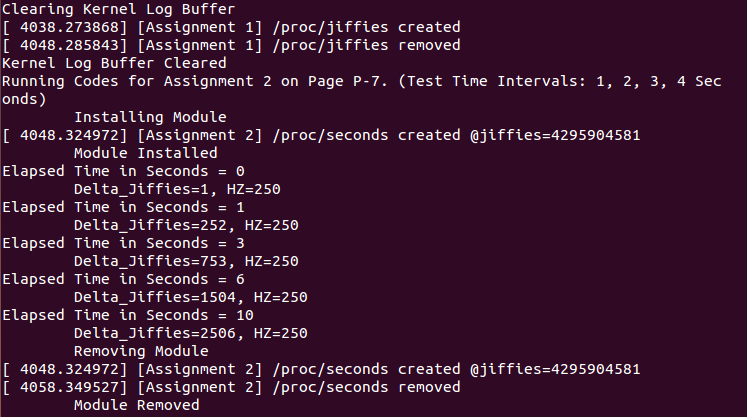

# Project 1 Report
EI338 Computer Systems Engineering, SJTU, 2020 Fall  
**by Prof. Li J.**
<!-- <br> -->


<br>

**TABLE OF CONTENTS**
<!-- MarkdownTOC -->

- [Description](#description)
- [Environment](#environment)
- [Project Details](#project-details)
    - [Toy Tasks](#toy-tasks)
    - [Assignment 1 - Jiffies](#assignment-1---jiffies)
    - [Assignemnt 2 - Seconds](#assignemnt-2---seconds)
- [Experiment](#experiment)
    - [Test Script](#test-script)
    - [Results](#results)
- [Summary](#summary)

<!-- /MarkdownTOC -->


<br>


<a id="description"></a>
## Description
1. The project is based on *Operating System Concepts (10th Edition) by Abraham Silberschatz, Peter Baer Galvin, Greg Gagne*, with [source codes](https://github.com/greggagne/osc10e) provided.
2. The major tasks of the project are
    + Toy Tasks
        * Print out the value of `GOLDEN_RATIO_PRIME` in the `simple_init()` function.
        * Print out the greatest common divisor of 3,300 and 24 in the `simple_exit()` function.
        * Print out the values of `jiffies` and `HZ` in the `simple_init()` function.
        * Print out the value of `jiffies` in the `simple_exit()` function.
    + Assignemnts
        * Design a kernel module that creates a /proc file named `/proc/jiffies` that reports the current value of `jiffies` when the `/proc/jiffies` file is read (such as with the command `cat /proc/jiffies`).
        * Design a kernel module that creates a proc file named `/proc/seconds` that reports the number of elapsed seconds since the kernel module was loaded. This will involve using the value of `jiffies` as well as the `HZ` rate. When a user enters the command `cat /proc/seconds` your kernel module will report the number of seconds that have elapsed since the kernel module was first loaded.


<a id="environment"></a>
## Environment
+ OS: `Ubuntu 14.04 LTS`, Linux Kernel Version `4.4.0-142-generic`
+ Compiler: `GCC Version 4.8.4`


<br>


<a id="project-details"></a>
## Project Details
<a id="toy-tasks"></a>
### Toy Tasks
To implement the toy tasks on Page P-4, just simply read the introduction and example codes. Some more slight modifications, by adding several `printk()` where necessary, lead to the following codes:
```C
// Exercises on Page P-4
// 1. Print out the value of GOLDEN_RATIO_PRIME in the simple init() function.
// 2. Print out the greatest common divisor of 3,300 and 24 in the simple_exit() function.
// 3. Print out the values of jiffies and HZ in the simple init() function.
// 4. Print out the value of jiffies in the simple exit() function.

#include <linux/init.h>
#include <linux/module.h>
#include <linux/kernel.h>

#include <linux/hash.h>
#include <linux/gcd.h>


/* [Module Entry Point] This function is called when the module is loaded. */
int simple_init(void) {
    printk(KERN_INFO
    "Loading Kernel Module \"Exercises on Page P-4\"\n");

    // Page "P-4" Exercise - 1
    // unsigned long GOLDEN_RATIO_PRIME
    printk(KERN_INFO
    "\t[EX 1] <unsigned long> GOLDEN_RATIO_PRIME = %lu\n", GOLDEN_RATIO_PRIME);

    // Page "P-4" Exercise - 3
    // HZ: timer tick rate (defined in <asm/param.h>)
    printk(KERN_INFO
    "\t[EX 3] HZ = %d\n", HZ);

    // Page "P-4" Exercise - 4
    // jiffies: # of timer interrupts occurred since the system was booted (defined in <linux/jiffies.h>)
    printk(KERN_INFO
    "\t[EX 4] jiffies = %lu\n", jiffies);


    return 0;
}

/* [Module Exit Point] This function is called when the module is removed. */
void simple_exit(void) {

    // Page "P-4" Exercise - 2
    // unsigned long gcd(unsigned long a, unsigned b);
    printk(KERN_INFO
    "\t[EX 2] <unsigned long> gcd(3300, 24) = %lu\n", gcd(3300, 24));

    printk(KERN_INFO
    "\t[EX 4] jiffies = %lu\n", jiffies);

    printk(KERN_INFO
    "Removing Kernel Module \"Exercises on Page P-4\"\n");
}

/* Macros for registering module entry and exit points. */
module_init(simple_init);
module_exit(simple_exit);

MODULE_LICENSE("GPL");
MODULE_DESCRIPTION("Exercises on P-4 Module, modified upon SGG's");
MODULE_AUTHOR("G");
```


<a id="assignment-1---jiffies"></a>
### Assignment 1 - Jiffies
Based on example codes `hello.c`, just add the current values of `jiffies` in `sprintf()`. Codes are given as follows:
```C
#include <linux/init.h>
#include <linux/module.h>
#include <linux/kernel.h>
#include <linux/proc_fs.h>
#include <asm/uaccess.h>

#include <linux/hash.h>


#define BUFFER_SIZE 128

#define PROC_NAME "jiffies"
// #define MESSAGE "Hello World\n"

/**
 * Function prototypes
 */
static ssize_t proc_read(struct file *file, char *buf, size_t count, loff_t *pos);

static struct file_operations proc_ops = {
        .owner = THIS_MODULE,

        // the name of the function (proc_read() here) that is to be called whenever /proc/hello is read.
        .read = proc_read,
};


/* This function is called when the module is loaded. */
static int proc_init(void)
{

    // creates the /proc/hello entry
    // the following function call is a wrapper for
    // proc_create_data() passing NULL as the last argument
    proc_create(PROC_NAME, 0, NULL, &proc_ops);

    printk(KERN_INFO "[Assignment 1] /proc/%s created\n", PROC_NAME);

    return 0;
}

/* This function is called when the module is removed. */
static void proc_exit(void) {

    // removes the /proc/hello entry
    remove_proc_entry(PROC_NAME, NULL);

    printk( KERN_INFO "[Assignment 1] /proc/%s removed\n", PROC_NAME);
}

/**
 * This function is called each time the /proc/hello is read.
 *
 * This function is called repeatedly until it returns 0, so
 * there must be logic that ensures it ultimately returns 0
 * once it has collected the data that is to go into the
 * corresponding /proc file.
 *
 * params:
 *
 * file:
 * buf: buffer in user space
 * count:
 * pos:
 */
static ssize_t proc_read(struct file *file, char __user *usr_buf, size_t count, loff_t *pos)
{
    int rv = 0;
    char buffer[BUFFER_SIZE];   // "buffer" exists in kernel memory
    static int completed = 0;

    if (completed) {
        completed = 0;
        return 0;
    }

    completed = 1;

    rv = sprintf(buffer, "jiffies = %lu\n", jiffies);

    // copies the contents of buffer to userspace usr_buf
    copy_to_user(usr_buf, buffer, rv);  // "usr_buf" exists in user space.

    return rv;
}


/* Macros for registering module entry and exit points. */
module_init(proc_init);
module_exit(proc_exit);

MODULE_LICENSE("GPL");
MODULE_DESCRIPTION("Jiffies Module, modified upon SGG's");
MODULE_AUTHOR("G");
```

<a id="assignemnt-2---seconds"></a>
### Assignemnt 2 - Seconds
The assignment is similar to the first assignment. We only need to

+ Define a global constant to store the value of `jiffies` when the module is loaded: `static unsigned long START_JIFFIES = 0;`
+ By the definition of `jiffies` and `HZ`, we may easily derive that the elapsed time in seconds can be calculated as:
$$ T = {jiffies} / {HZ}$$

Codes are given as follows:
```C
#include <linux/init.h>
#include <linux/module.h>
#include <linux/kernel.h>
#include <linux/proc_fs.h>
#include <asm/uaccess.h>

#include <linux/hash.h>


#define BUFFER_SIZE 128

#define PROC_NAME "seconds"
// #define MESSAGE "Hello World\n"

static unsigned long START_JIFFIES = 0;

/**
 * Function prototypes
 */
static ssize_t proc_read(struct file *file, char *buf, size_t count, loff_t *pos);

static struct file_operations proc_ops = {
        .owner = THIS_MODULE,

        // the name of the function (proc_read() here) that is to be called whenever /proc/hello is read.
        .read = proc_read,
};


/* This function is called when the module is loaded. */
static int proc_init(void)
{

    // creates the /proc/hello entry
    // the following function call is a wrapper for
    // proc_create_data() passing NULL as the last argument
    proc_create(PROC_NAME, 0, NULL, &proc_ops);

    START_JIFFIES = jiffies;
    printk(KERN_INFO "[Assignment 2] /proc/%s created @jiffies=%lu\n",
           PROC_NAME, START_JIFFIES);

    return 0;
}

/* This function is called when the module is removed. */
static void proc_exit(void) {

    // removes the /proc/hello entry
    remove_proc_entry(PROC_NAME, NULL);

    printk(KERN_INFO "[Assignment 2] /proc/%s removed\n", PROC_NAME);
}

/**
 * This function is called each time the /proc/hello is read.
 *
 * This function is called repeatedly until it returns 0, so
 * there must be logic that ensures it ultimately returns 0
 * once it has collected the data that is to go into the
 * corresponding /proc file.
 *
 * params:
 *
 * file:
 * buf: buffer in user space
 * count:
 * pos:
 */
static ssize_t proc_read(struct file *file, char __user *usr_buf, size_t count, loff_t *pos)
{
    int rv = 0;
    char buffer[BUFFER_SIZE];   // "buffer" exists in kernel memory
    static int completed = 0;

    if (completed) {
        completed = 0;
        return 0;
    }

    completed = 1;
    
    rv = sprintf(buffer, 
                 "Elapsed Time in Seconds = %lu\n\tDelta_Jiffies=%lu, HZ=%d\n",
                 ((jiffies - START_JIFFIES) / HZ), (jiffies - START_JIFFIES), HZ);

    // copies the contents of buffer to userspace usr_buf
    copy_to_user(usr_buf, buffer, rv);  // "usr_buf" exists in user space.

    return rv;
}


/* Macros for registering module entry and exit points. */
module_init(proc_init);
module_exit(proc_exit);

MODULE_LICENSE("GPL");
MODULE_DESCRIPTION("Seconds Module, modified upon SGG's");
MODULE_AUTHOR("G");
```


<br>


<a id="experiment"></a>
## Experiment

<a id="test-script"></a>
### Test Script
For convenience, a `.sh` script is designed to test all the codes.  
To use, say the script file named `run.sh` stored in the same directory where the codes are, execute `sudo sh run.sh` (or `sudo sh run.sh > out.txt` to save the outputs).  
The codes are given as follows:
```bash
clear_dmesg(){
    echo "Clearing Kernel Log Buffer"
    dmesg -c
    echo "Kernel Log Buffer Cleared"
}

make
clear_dmesg
echo "Initialized"


# Exercises on Page P-4
echo "Running Codes for Exercises on Page P-4"

# install module
echo "\tInstalling Module"
insmod ex_P-4.ko
dmesg
echo "\tModule Installed"

# remove module
echo "\tRemoving Module"
rmmod ex_P-4
dmesg
echo "\tModule Removed"


# Assignment 1 on Page P-7
clear_dmesg
echo "Running Codes for Assignment 1 on Page P-7. (Test Time Intervals: 1, 2, 3, 4 Seconds)"

# install module
echo "\tInstalling Module"
insmod asgn_1_jiffies.ko
dmesg
echo "\tModule Installed"

# 5 test rounds
cat /proc/jiffies
sleep 1
cat /proc/jiffies
sleep 2
cat /proc/jiffies
sleep 3
cat /proc/jiffies
sleep 4
cat /proc/jiffies

# remove module
echo "\tRemoving Module"
rmmod asgn_1_jiffies
dmesg
echo "\tModule Removed"


# Assignment 2 on Page P-7
clear_dmesg
echo "Running Codes for Assignment 2 on Page P-7. (Test Time Intervals: 1, 2, 3, 4 Seconds)"

# install module
echo "\tInstalling Module"
insmod asgn_2_seconds.ko
dmesg
echo "\tModule Installed"

# 5 test rounds
cat /proc/seconds
sleep 1
cat /proc/seconds
sleep 2
cat /proc/seconds
sleep 3
cat /proc/seconds
sleep 4
cat /proc/seconds

# remove module
echo "\tRemoving Module"
rmmod asgn_2_seconds
dmesg
echo "\tModule Removed"
```

<a id="results"></a>
### Results

<div style="text-align: center;">
    
    
    
</div>


<br>

<a id="summary"></a>
## Summary
Generally speaking, the project tasks are somehow simple and straight-forward.

However, since floating point operations are not recommended due to hardware architecture capability concerns (even though posiible on Linux), the "seconds" assignment results cannot be satisfactory enough (which now only support printing integer elapsed time).