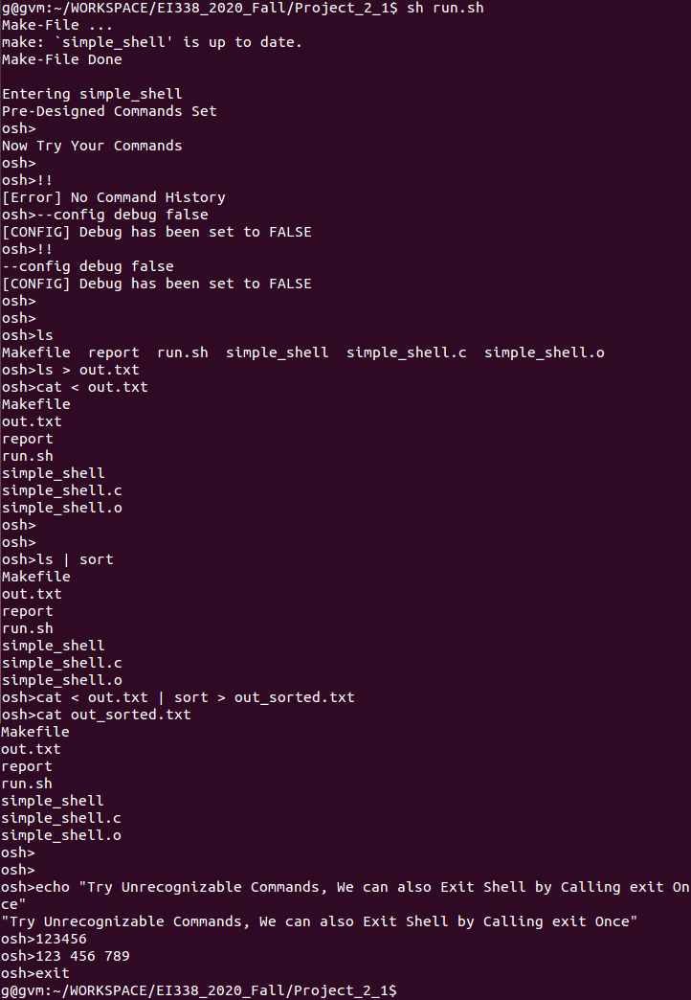
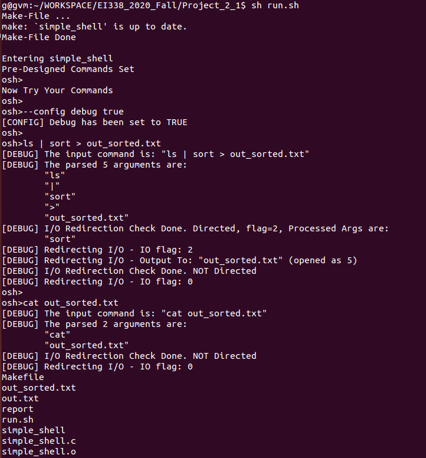

# Project 2-1 Report
EI338 Computer Systems Engineering, SJTU, 2020 Spring  
**by Prof. Li J.**
<!-- <br> -->


<br>

**TABLE OF CONTENTS**
<!-- MarkdownTOC -->

- [Description](#description)
- [Environment](#environment)
- [Project Details](#project-details)
    - [Genral Execution Logic](#genral-execution-logic)
    - [Command Input](#command-input)
        - [Naive Input](#naive-input)
        - [Read from History](#read-from-history)
    - [Parse Command Arguments](#parse-command-arguments)
    - [Simple Command Execution](#simple-command-execution)
        - [General](#general)
        - [Concurrency](#concurrency)
    - [I/O Redirection](#io-redirection)
    - [Pipe Communication](#pipe-communication)
    - [Addition Features](#addition-features)
        - ["Empty" Commands](#empty-commands)
        - [Command to Exit and Help](#command-to-exit-and-help)
        - [Exit Problems during Commands Execution Failure](#exit-problems-during-commands-execution-failure)
        - [Debug Messages](#debug-messages)
- [Experiment](#experiment)
    - [Test Script](#test-script)
    - [Test Commands](#test-commands)
    - [Test Results](#test-results)
- [Summary](#summary)

<!-- /MarkdownTOC -->


<br>


<a id="description"></a>
## Description
1. The project is based on Project 1 **UNIX SHELL** of Chapter 3 of *Operating System Concepts (10th Edition) by Abraham Silberschatz, Peter Baer Galvin, Greg Gagne*, with [source codes](https://github.com/greggagne/osc10e) provided.
2. The major tasks of the project are
    + Basic Command Execution
        * Get the input commands from teh keyboard.
        * Parse the stored input commands by arguments (including checking the ampersand `&`)
        * Execute the command with arguments in a child process.
    + Add History Command Inputs
    + Add I/O Redirection
    + Add Pipe to Enable Parent and Child Process to Communicate
3. The reprot is organized as follows:
    + Genral Execution Logic
    + Command Input
        * Naive Input
        * Read from History
    + Parse Command Arguments
    + Simple Command Execution
        * General
        * Concurrency Handle
    + I/O Redirection
    + Pipe Communication
    + Additional Features
4. The implementations are mainly based on those by [@keithnull](https://github.com/keithnull/Learning-EI338/tree/master/Project-2-1)

<br>

<a id="environment"></a>
## Environment
+ OS: `Ubuntu 14.04 LTS`, Linux Kernel Version `4.4.0-142-generic`
+ Compiler: `GCC Version 4.8.4`


<br>


<a id="project-details"></a>
## Project Details
<a id="genral-execution-logic"></a>
### Genral Execution Logic
We may modify codes based on the provided `simple_shell.c`, i.e., handle inputs, parse arguments, execute commands, which lead to the top-level `main()` function given below:
```C
static int DEBUG = 0;                   // DEBUG Mode Flag, whether to Show Hint Messages

/*!
 *   Refresh the Content of Arguments, i.e., Free Old Contents and Set to NULL
 *   @param: args           the array to refresh
 */
void refresh_args(char *args[]) {
    while (*args) {
        free(*args);                    // to avoid memory leaks
        *args++ = NULL;
    }
}

int main(void) {
    char *args[MAX_LINE / 2 + 1];       // command line arguments
    char command[MAX_LINE + 1];

    // [INIT] Initialize the arguments, set as NULL
    for (size_t i = 0; i <= MAX_LINE / 2; i++) { args[i] = NULL; }
    // [INIT] Initialize the command, set as an empty string
    strcpy(command, "");

    while (1) {
        printf("osh>");
        fflush(stdout);                 // flush the stream buffer

        fflush(stdin);                  // flush the stream buffer
        refresh_args(args);             // empty args before parsing

        // [INPUT] Get and store the input (notice that "empty" command ENTER is a success)
        if (!get_input(command)) { continue; }

        // [INPUT] Parse the input command
        size_t args_num = parse_input(args, command);
        if (0 == args_num) { continue; }

        // [RUN] [Extra]
        // SOME CODES

        // [RUN] Execute command
        run_command(args, args_num);
        fflush(stdout);                 // flush the stream buffer
    }


    return 0;
}
```

<br>


<a id="command-input"></a>
### Command Input
<a id="naive-input"></a>
#### Naive Input
To simply get the command input from keyboard, we may handle using a input buffer and then simply copy from buffer to the target command variable.
```C
#define MAX_LINE 80                     // Maximum Command Length

/*!
 * Get Command from Input (with EOL \n, \r removed) or History
 * @param command               variable to store the command, also the last command
 * @return                      1 = successful, 0 = unsuccessful
 */
int get_input(char *command) {
    char input_buffer[MAX_LINE + 1];

    // read one line of inputs (length <= MAX_LINE) and store in buffer
    if (fgets(input_buffer, MAX_LINE + 1, stdin) == NULL) {
        fprintf(stderr, "[Error] Failed to Read NULL Inputs\n");
        return 0;
    }

    // remove EOL \n, \r
    input_buffer[strlen(input_buffer) - 1] = '\0';

    // handle "empty" command, i.e., only the removed ENTER
    if (0 == strlen(input_buffer)) { return 0; }

    // [History] handle history
    // SOME CODES

    // [Non-History] update the command by the inputs
    strcpy(command, input_buffer);

    return 1;
}
```

<a id="read-from-history"></a>
#### Read from History
Compare the input command with `!!` to judge whether read rom history.  
If so, just do nothing upon the variable where the previous command is stored and print the history command.  
We may just add the following codes:
```C
// [History] handle history
if (strncmp(input_buffer, "!!", 2) == 0) {
    // no command history
    if (strlen(command) == 0) {
        fprintf(stderr, "[Error] No Command History\n");
        return 0;
    }
    // print the stored history, keep the command unchanged and exit
    printf("%s\n", command);
    return 1;
}
```

<br>


<a id="parse-command-arguments"></a>
### Parse Command Arguments
To Parse command arguments, we may split the input command string by SPACE delimiters `" \t\n\v\f\r"`. Codes are given as follows:
```C
#define DELIMITERS " \t\n\v\f\r"        // Delimiters of Parts in Commands

/*!
 * Parse Input and Store Arguments
 * @param args                  the array to store the parsed arguments
 * @param original_command      the input command
 * @return                      the number of arguments
 */
size_t parse_input(char *args[], char *original_command) {
    size_t num = 0;

    // make a copy of input command since separation strtok() will change the values
    char command[MAX_LINE + 1];
    strcpy(command, original_command);

    // continuously separate arguments by delimiters until End-of-Line
    char *token = strtok(command, DELIMITERS);
    while (token != NULL) {
        // store the split arguments to the "referred output" argument variable
        args[num] = malloc(strlen(token) + 1);
        strcpy(args[num], token);
        num++;
        token = strtok(NULL, DELIMITERS);
    }

    return num;
}
```

<br>


<a id="simple-command-execution"></a>
### Simple Command Execution
<a id="general"></a>
#### General
The simple command execution can be done via `fork()` a new child process, `execvp(command, *args)`. Codes are given as follows:
```C
/*!
 * Run the Input Command, via Parsed Arguments
 * @param args                  arguments list
 * @param args_num              number of arguments
 * @return                      success or not
 */
int run_command(char **args, size_t args_num) {
    // [CONCURRENT] Detect '&' to determine whether to run concurrently
    int run_concurrently = check_ampersand(args, &args_num);

    // [PIPE] Init, Check
    char **args2;
    size_t args_num2 = 0;
    check_pipe(args, &args_num, &args2, &args_num2);

    // [EXECUTE] Create a child process
    pid_t pid = fork();

    // fork failed
    if (pid < 0) {
        fprintf(stderr, "[Error] Failed to fork the child process while executing\n");
        return 0;
    }

    // [PROCESS] child process
    if (pid == 0) {
        // [PIPE] Using pipe
        if (args_num2 != 0) {
            // SOME CODES
        }

        // [PIPE] NO pipe
        else {
            // redirect I/O
            // SOME CODES
            
            // execute
            int exe_result = execvp(args[0], args);
            fflush(stdin);
            if (-1 == exe_result) exit(0);
        }
    }

    // [PROCESS] parent process
    else {
        // parent waits for child's exit, i.e, not concurrently
        if (!run_concurrently) {
            wait(NULL);
        }
    }

    return 1;
}
```


<a id="concurrency"></a>
#### Concurrency
We ought to first check whether `&` is in the last argument of the input command and do corresponding updates. Codes are given as follows:
```C
/*!
 *   Check whether an Ampersand (&) is in the End of Arguments. If so,
 *      (1) remove '&' from the last arg
 *      (2) remove the whole last arg if it becomes empty (actually should be)
 *   @param: args           the array to check
 *   @param: size           the pointer to array size
 *   @return                whether an ampersand is in the end: 1=yes, 0=no
 */
int check_ampersand(char **args, size_t *size) {

    size_t len = strlen(args[*size - 1]);

    // check whether & is in the last argument
    if (args[*size - 1][len - 1] != '&') { return 0; }

    // remove the whole last arg if arg=='&' exactly, should be if '&' is included
    if (len == 1) {
        free(args[*size - 1]);
        args[*size - 1] = NULL;
        --(*size);                      // reduce its size
    }
        // remove only the '&' in the last command
    else { args[*size - 1][len - 1] = '\0'; }


    return 1;
}
```

Then, while executing the command, we ought to,

1. Check the ampersand
2. Let the parent process wait for the child process to end **iff** concurrency is not required. The added and modified codes are already shown in the above codes of command execution.

<br>


<a id="io-redirection"></a>
### I/O Redirection
First we ought to check whether `<` or `>` is included in the command. Codes are given as follows:
```C
/*!
 *   Check the Redirection Symbols in the Arguments
 *      (1) remove "<", ">"         (2) remove the in-/out-put file arg
 *      * Notice that it is assumed that only one of "<", ">" will appear at most once
 *   @param: args           arguments list
 *   @param: size           the number of arguments
 *   @param: input_file     file name for input
 *   @param: output_file    file name for output
 *   @return:               IO flag (bit 1 for output, bit 0 for input)
 */
unsigned check_io_redirection(char **args, size_t *size, char **input_file, char **output_file) {
    unsigned flag = 0;
    size_t to_remove[4], remove_cnt = 0;
    for (size_t i = 0; i <= *size - 1; i++) {
        if (remove_cnt >= 4) { break; }

        // [INPUT] input symbol detected
        if (strcmp("<", args[i]) == 0) {
            to_remove[remove_cnt++] = i;
            if (i == (*size) - 1) {
                fprintf(stderr, "[Error] Input from UNKNOWN File\n");
                break;
            }
            flag |= 1;
            *input_file = args[i + 1];
            to_remove[remove_cnt++] = ++i;
        }

            // [OUTPUT] output symbol detected
        else if (strcmp(">", args[i]) == 0) {
            to_remove[remove_cnt++] = i;
            if (i == (*size) - 1) {
                fprintf(stderr, "[Error] Output to UNKNOWN File\n");
                break;
            }
            flag |= 2;
            *output_file = args[i + 1];
            to_remove[remove_cnt++] = ++i;
        }
    }

    // [REMOVE] Remove I/O indicators and filenames from arguments
    for (int i = remove_cnt - 1; i >= 0; --i) {
        size_t pos = to_remove[i];      // the index of arg to remove
        // printf("%lu %s\n", pos, args[pos]);
        while (pos != *size) {
            args[pos] = args[pos + 1];
            ++pos;
        }
        --(*size);
    }

    return flag;
}
```

Then, we ought to implement the way to conduct redirection and handle file close.  
Notice that, since we may create a file during output redirection, **PERMISSIONS** should be handled carfully. Refering [open() - wikipedia](https://en.wikipedia.org/wiki/Umask), we may select `unmask 0644` for simplicity. If we specify 'numbers' such as `644`, we can only read the created redirected file in `sudo`, i.e., root mode.
```C
/*!
 *   Open Target Files and Redirect I/O
 *   @param: io_flag        the flag for IO redirection (bit 1 for output, bit 0 for input)
 *   @param: input_file     file name for input
 *   @param: output_file    file name for output
 *   @param: input_decs     file descriptor of input file (like the file-opened object in Python)
 *   @param: output_decs    file descriptor of output file (like the file-opened object in Python)
 *   @return:               1 = successful, 0 = unsuccessful
 */
int redirect_io(unsigned io_flag, char *input_file, char *output_file, int *input_desc, int *output_desc) {
    if (1 == DEBUG) {
        printf("[DEBUG] Redirecting I/O - IO flag: %u\n", io_flag);
    }

    // [OUTPUT] Redirect output
    if (io_flag & 2) {
        *output_desc = open(output_file, O_WRONLY | O_CREAT | O_TRUNC, 0644);    // unmask auth
        if (*output_desc < 0) {
            fprintf(stderr, "[Error] Failed to open the output file: \"%s\"\n", output_file);
            return 0;
        }
        dup2(*output_desc, STDOUT_FILENO);
    }

    // [OUTPUT] Redirect intput
    if (io_flag & 1) { // redirecting input
        *input_desc = open(input_file, O_RDONLY, 0644);                         // unmask auth
        if (*input_desc < 0) {
            fprintf(stderr, "[Error] Failed to open the input file: \"%s\"\n", input_file);
            return 0;
        }
        dup2(*input_desc, STDIN_FILENO);
    }

    return 1;
}

/*!
 *   Close Files for I/O Redirection
 *   @param: io_flag        the flag for IO redirection (bit 1 for output, bit 0 for input)
 *   @param: input_decs     file descriptor of input file
 *   @param: output_decs    file descriptor of output file
 */
void close_file(unsigned io_flag, int input_desc, int output_desc) {
    if (io_flag & 2)  close(output_desc);
    if (io_flag & 1)  close(input_desc);
}
```

Then, during commands execution, we may just add the following codes:
```C
// redirect I/O
char *input_file, *output_file;
int input_desc, output_desc;
unsigned io_flag = check_io_redirection(
        args, &args_num, &input_file, &output_file);    // bit 1=output, bit 0=input
if (0 == redirect_io(io_flag, input_file, output_file, &input_desc, &output_desc)) {
    return 0;
}
// execute command
// SOME CODES
close_file(io_flag, input_desc, output_desc);
```

<br>


<a id="pipe-communication"></a>
### Pipe Communication
Similarly, we ought to first check whether a pipe is required. If so, split the commands into two parts. Codes are given as follows:
```C
/*!
 *   Detect the Pipe Symbol '|' and split arguments into two parts accordingly
 *      Notice that it is assumed that
 *          (1) '|' will appear at most once    (2) no I/O redirection symbols will appear
 *   @param: args           arguments list for the first command
 *   @param: args_num       number of arguments for the first command
 *   @param: args2          arguments list for the second command
 *   @param: args_num2      number of arguments for the second command
 */
void check_pipe(char **args, size_t *args_num, char ***args2, size_t *args_num2) {
    int is_pipe = 0;
    for (size_t i = 0; i <= *args_num - 1; ++i) {
        if (strcmp(args[i], "|") == 0) {
            is_pipe = 1;
            free(args[i]);
            args[i] = NULL;
            *args_num2 = *args_num - i - 1;
            *args_num = i;
            *args2 = args + i + 1;
            break;
        }
    }
}
```

While executing commands, remember to check pipe at the beginning, like,
```C
// [PIPE] Init, Check
char **args2;
size_t args_num2 = 0;
check_pipe(args, &args_num, &args2, &args_num2);
```

Then, to execute pipe-related commands in the child process, through the grandchild and the grand-grandchild process, we implement as follows:
```C
// [PIPE] Using pipe
if (args_num2 != 0) {
    // create pipe
    int fd[2];
    int pipe_create = pipe(fd);
    if (-1 == pipe_create) {
        fprintf(stderr, "[Error] Pipe Creation Failed\n");
        return 0;
    }

    // fork grandchild & grand-grandchild process
    pid_t pid2 = fork();
    // grand-grandchild process - the second command of the pipe
    if (pid2 > 0) {
        // redirect I/O
        char *input_file, *output_file;
        int input_desc, output_desc;
        unsigned io_flag = check_io_redirection(
                args2, &args_num2, &input_file, &output_file);    // bit 1 for output, bit 0 for input
        io_flag &= 2;           // disable input redirection since input is provided from pipe
        if (redirect_io(io_flag, input_file, output_file, &input_desc, &output_desc) == 0) {
            return 0;
        }
        close(fd[1]);
        dup2(fd[0], STDIN_FILENO);
        wait(NULL);             // wait for the first command to finish
        int exe_result = execvp(args2[0], args2);
        close_file(io_flag, input_desc, output_desc);
        close(fd[0]);
        fflush(stdin);
        if (-1 == exe_result) exit(0);
    }
    // grandchild process - the first command of the pipe
    else if (0 == pid2) {
        // redirect I/O
        char *input_file, *output_file;
        int input_desc, output_desc;
        unsigned io_flag = check_io_redirection(
                args, &args_num, &input_file, &output_file);    // bit 1 for output, bit 0 for input
        io_flag &= 1;           // disable output redirection since output will be passed through pipe
        if (redirect_io(io_flag, input_file, output_file, &input_desc, &output_desc) == 0) {
            return 0;
        }
        close(fd[0]);
        dup2(fd[1], STDOUT_FILENO);
        int exe_result = execvp(args[0], args);
        close_file(io_flag, input_desc, output_desc);
        close(fd[1]);
        fflush(stdin);
        if (-1 == exe_result) exit(0);
    }
}
```

<br>


<a id="addition-features"></a>
### Addition Features

<a id="empty-commands"></a>
#### "Empty" Commands
While handling input commands, a frequently occurred problem is about the empty command (by tap `ENTER` only). In most Command-Line-Interface, such actions creates an empty line on the shell and execute nothing, so that the commands are more readable.  
Therefore, here, instead of raising an "error" to encourage the user to type commands, the do-nothing approach is followed.  
Since during input commands fetching (in function `get_input()`), end-of-line line breaks are removed, we may just check the count of the arguments and return an unsuccessful signal if it is 0.
Codes are given as follows:
```C
// remove EOL \n, \r
input_buffer[strlen(input_buffer) - 1] = '\0';

// handle "empty" command, i.e., only the removed ENTER
if (0 == strlen(input_buffer)) { return 0; }
```


<a id="command-to-exit-and-help"></a>
#### Command to Exit and Help
In most Command-Line-Interface, `exit` is called to exit the shell and `help` to show help messages. Such functionalities are also implemented, as in function `main()` after the argument parse:
```C
void print_help_msg() {
    printf("A Simple UNIX Shell\n\n"
           "usage: <command> [<args>]\n\n"
           "These are common commands used in various situations:\n\n"
           "Control Commands\n"
           "  ?, help, -help, --help             Show the help messages\n"
           "  --config debug true/false        Whether to show debug messages\n"
           "  exit                               Exit the simple UNIX shell\n"
           "\n"
           "Some other UNIX commands are also supported, you may try yourself\n");
}

int main(void) {
    // SOME CODES
    while (1) {
        // SOME CODES
        // [RUN] [Extra] Enable "exit" command
        if (strcmp(args[0], "exit") == 0) { break; }

        // [RUN] [Extra] Enable "?", "help", "-help", "--help" command
        if (strcmp(args[0], "?") == 0 || strcmp(args[0], "help") == 0 ||
            strcmp(args[0], "-help") == 0 || strcmp(args[0], "--help") == 0) {
            print_help_msg();
            continue;
        }
        // SOME CODES
    }
    // SOME CODES
}
```


<a id="exit-problems-during-commands-execution-failure"></a>
#### Exit Problems during Commands Execution Failure
In practice, a problem arised that when we want to exit after a command execution failure (generic failure or by unrecoginzable commands), **at least two** `exit` commands must be called. For instance,
```bash
osh>12344 1234   // unrecoginzable command
osh>exit         // still in the shell
osh>exit         // finally returned 
```
Intuitively, the failed child process is not terminated. Thus, we must determine the execution status and manually exit the child process if necessary.  
To tackle such failure detection, we may take advantage of the return value of the bulit-in function `execvp()` ([reference](https://blog.csdn.net/qq_39309971/article/details/80216007)), where `-1` is returned when a failure occurred. Thus, we modify out codes:
```C
// naive approach
exe_result = execvp(args[0], args);

// modified approach to tackle exit
int exe_result = execvp(args[0], args);
if (-1 == exe_result) exit(0);
```


<a id="debug-messages"></a>
#### Debug Messages
We may also add some debug intermediate argument prints or hint messages in various situations. Moreover, add `--config debug true/false` support in function `main()` to change the `static int` debug flag.  
Codes are given as follows:
```C
static int DEBUG = 0;                   // DEBUG Mode Flag, whether to Show Hint Messages

int main(void) {
    // SOME CODES
    while (1) {
        // SOME CODES
        // [RUN] [Extra] Enable "--config debug true/false" command
        if (3 == args_num && strcmp(args[0], "--config") == 0 && strcmp(args[1], "debug") == 0) {
            if (strcmp(args[2], "true") == 0) {
                DEBUG = 1;
                printf("[CONFIG] Debug has been set to TRUE\n");
            }
            else if (strcmp(args[2], "false") == 0) {
                DEBUG = 0;
                printf("[CONFIG] Debug has been set to FALSE\n");
            }
            else {
                fprintf(stderr, "[Error] Unknown Config Value of DEBUG. "
                            "Expected \"true\" or \"false\", Got \"%s\"\n", args[2]);
            }
            continue;
        }
        // SOME CODES
    }
    // SOME CODES
}
```


<br><br>


<a id="experiment"></a>
## Experiment

<a id="test-script"></a>
### Test Script
For convenience, a `.sh` script is designed for easier test experience.  
To use, say the script file named `run.sh` stored in the same directory where the codes are, execute `sh run.sh`). Executing previously designed set of codes is also supported.   
The codes are given as follows:
```bash
echo "Make-File ..."
make
echo "Make-File Done"

echo ""
echo "Entering simple_shell"

echo "Pre-Designed Commands Set"
./simple_shell <<'EOF'
exit
EOF

echo ""
echo "Now Try Your Commands"
./simple_shell
```


<a id="test-commands"></a>
### Test Commands
```bash
!!
--config debug false
!!

ls
ls > out.txt
cat < out.txt

ls | sort
cat < out.txt | sort > out_sorted.txt
cat out_sorted.txt

echo "Try Unrecognizable Commands, We can also Exit Shell by Calling exit Once"
123456
123 456 789
```

<a id="test-results"></a>
### Test Results
The test results are shown below:  
<center>
        
</center>

Additional screenshot illustrating the debug messages is given as follows:  
<center>
    
</center>


<br>

<a id="summary"></a>
## Summary
Generally speaking, the project tasks are more of a C language programming, about which I have forgotten most details. Thus, reference codes really do help me a lot.