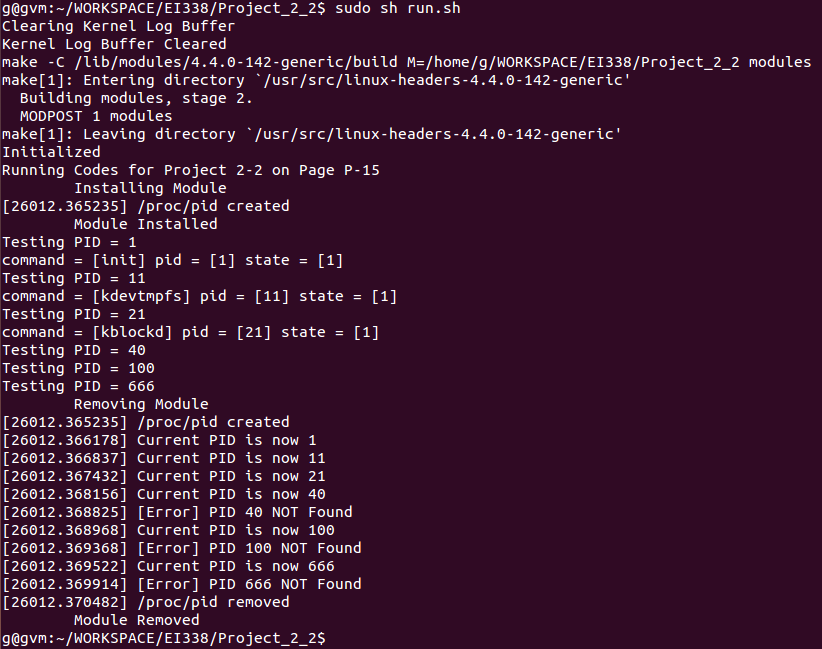

# Project 2-2 Report
EI338 Computer Systems Engineering, SJTU, 2020 Fall  
**by Prof. Li J.**
<!-- <br> -->


<br>

**TABLE OF CONTENTS**
<!-- MarkdownTOC -->

- [Description](#description)
- [Environment](#environment)
- [Project Details](#project-details)
    - [Writing to the `/proc` File System](#writing-to-the-proc-file-system)
    - [Reading from the `/proc` File System](#reading-from-the-proc-file-system)
- [Experiment](#experiment)
    - [Test Script](#test-script)
    - [Test Results](#test-results)
- [Summary](#summary)
- [Appendix - All Codes](#appendix---all-codes)

<!-- /MarkdownTOC -->


<br>


<a id="description"></a>
## Description
1. The project is based on Project 2 **Linux Kernel Module for Task Information** of Chapter 3 of *Operating System Concepts (10th Edition) by Abraham Silberschatz, Peter Baer Galvin, Greg Gagne*, with [source codes](https://github.com/greggagne/osc10e) provided.
2. The major tasks of the project are
    + Writing to the `/proc` File System
        * Copy the stored user input into kernel memory
        * Translate to the PID integer
    + Reading from the `/proc` File System
        * Fetch the process/task information of the assigned PID
        * Print three fields:
            - the command the task is running
            - the value of the task’s PID
            - the current state of the task
<br>

<a id="environment"></a>
## Environment
+ OS: `Ubuntu 14.04 LTS`, Linux Kernel Version `4.4.0-142-generic`
+ Compiler: `GCC Version 4.8.4`


<br>


<div style="page-break-after: always;"></div>


<a id="project-details"></a>
## Project Details
<a id="writing-to-the-proc-file-system"></a>
### Writing to the `/proc` File System
After understanding the general logic of the writing process (described in the handouts) and referring the provided codes, we ought to implement the string-to-integer translation of PID.  
Notice that, as hinted in the codes, the recommended `kstrol()` function  will not work because the user input raw strings are not guaranteed to be null-terminated. Instead, we may turn to `sscanf()` with signature  
```C
    int sscanf(const char *buffer, const char *format, [argument]...);
```

As a result, we may modify codes to:
```C
static int PID_CRT_INT;                      // the current pid

static ssize_t proc_write(struct file *file, const char __user *usr_buf, size_t count, loff_t *pos) {
    char *k_mem;
    // allocate kernel memory - routine kernel memory allocation
    k_mem = kmalloc(count, GFP_KERNEL);

    // copies user space "usr_buf" to kernel buffer
    if (copy_from_user(k_mem, usr_buf, count)) {
        printk(KERN_INFO "Error copying from user\n");
        return -1;
    }

    /**
     * kstrol() will not work because the strings are not guaranteed to be null-terminated.
     * sscanf() must be used instead.
     */
    sscanf(k_mem, "%d", &PID_CRT_INT);
    printk(KERN_INFO "Current PID is now %d\n", PID_CRT_INT);

    // release memory
    kfree(k_mem);

    return count;
}
```

<br>


<a id="reading-from-the-proc-file-system"></a>
### Reading from the `/proc` File System
Similarly, we may easily clarify that our tasks, as getting and printing the task information of the given PID.

There are some points that require attention:

1. In my case, the root of the related headers source files is at `/usr/src/linux-headers-4.4.0-142/include/linux/`.
2. We may find function prototype `struct pid *find_vpid(int nr);` in `pid.h`. 
    + As a result, the type of the variable `l_pid` (renamed to `PID_CRT_INT`), where the current PID is stored, should be modified from `static long` to `static int` for compacity.
    + It is also the reason why in the previous section, the translation is committed as type identifier `%d` instead of `%ld`.
3. We may find the required task information fields in `struct task_struct` in `sched.h`, as

```C
struct task_struct {
    volatile long state;    /* -1 unrunnable, 0 runnable, >0 stopped */
    /* SOME OTHER FIELDS */
    char comm[TASK_COMM_LEN]; /* executable name excluding path
                     - access with [gs]et_task_comm (which lock
                       it with task_lock())
                     - initialized normally by setup_new_exec */
    /* SOME OTHER FIELDS */
};
```

Finally, we may implement the `/proc` read functionalities as follows:  
```C
static int PID_CRT_INT;                      // the current pid

static ssize_t proc_read(struct file *file, char __user *usr_buf, size_t count, loff_t *pos) {
    int rv = 0;
    char buffer[BUFFER_SIZE];
    static int completed = 0;
    struct task_struct *tsk = NULL;

    if (completed) {
        completed = 0;
        return 0;
    }

    tsk = pid_task(find_vpid(PID_CRT_INT), PIDTYPE_PID);
    if (NULL == tsk){
        printk(KERN_INFO "[Error] PID %d NOT Found\n", PID_CRT_INT);
        return 0;
    }
    else {
        rv = sprintf(buffer,
                     "command = [%s] pid = [%d] state = [%ld]\n",
                     tsk->comm, PID_CRT_INT, tsk->state);
    }

    completed = 1;

    // copies the contents of kernel buffer to userspace usr_buf
    if (copy_to_user(usr_buf, buffer, rv)) {
        rv = -1;
    }

    return rv;
}
```


<br><br>


<a id="experiment"></a>
## Experiment

<a id="test-script"></a>
### Test Script
First, to test in both cases --- valid PIDs, invalid PIDs, we may execute `htop` to grab some valid ones.  
Meanwhile, for convenience, a `.sh` script (named, say, `run.sh`) is designed for easier test experience (placed in the same directory with the source codes). To use, simply execute `sudo sh run.sh`.
The codes are given as follows:

```sh
clear_dmesg(){
    echo "Clearing Kernel Log Buffer"
    dmesg -c
    echo "Kernel Log Buffer Cleared"
}

clear_dmesg
make
echo "Initialized"

# Exercises on Page P-15
echo "Running Codes for Project 2-2 on Page P-15"

# install module
echo "\tInstalling Module"
insmod pid_module.ko
dmesg
echo "\tModule Installed"

for i in 1 11 21 40 100 666
do
    echo "Testing PID = $i"
    echo $i > /proc/pid
    cat /proc/pid
done

# remove module
echo "\tRemoving Module"
rmmod pid_module
dmesg
echo "\tModule Removed"
```


<a id="test-results"></a>
### Test Results
The test results are shown below:  
<div style="text-align: center;">
    
</div>


<br><br>

<a id="summary"></a>
## Summary
Generally speaking, the project tasks are more of following the instructions on the handouts. However, from the codes, I have gained a deeper insight of built-in functions, the process information, etc, which are quite helpful.


<br><br><br>


<div style="page-break-after: always;"></div>


<a id="appendix---all-codes"></a>
## Appendix - All Codes
```C
/**
 * Kernel module that communicates with /proc file system.
 *
 * This provides the base logic for Project 2 - displaying task information
 */

#include <linux/init.h>
#include <linux/slab.h>
#include <linux/sched.h>
#include <linux/module.h>
#include <linux/kernel.h>
#include <linux/proc_fs.h>
#include <linux/vmalloc.h>
#include <asm/uaccess.h>

#define BUFFER_SIZE 128
#define PROC_NAME "pid"

static int PID_CRT_INT;                      // the current pid

/**
 * Function prototypes
 */
static ssize_t proc_read(struct file *file, char *buf, size_t count, loff_t *pos);
static ssize_t proc_write(struct file *file, const char __user *usr_buf, size_t count, loff_t *pos);

static struct file_operations proc_ops = {
        .owner = THIS_MODULE,
        .read = proc_read,
        .write = proc_write,
};

/* This function is called when the module is loaded. */
static int proc_init(void) {
    // creates the /proc/procfs entry
    proc_create(PROC_NAME, 0666, NULL, &proc_ops);

    printk(KERN_INFO "/proc/%s created\n", PROC_NAME);

    return 0;
}

/* This function is called when the module is removed. */
static void proc_exit(void) {
    // removes the /proc/procfs entry
    remove_proc_entry(PROC_NAME, NULL);

    printk(KERN_INFO "/proc/%s removed\n", PROC_NAME);
}

/**
 * This function is called each time the /proc/pid is read.
 * 
 * This function is called repeatedly until it returns 0, so
 * there must be logic that ensures it ultimately returns 0
 * once it has collected the data that is to go into the 
 * corresponding /proc file.
 */
static ssize_t proc_read(struct file *file, char __user *usr_buf, size_t count, loff_t *pos) {
    int rv = 0;
    char buffer[BUFFER_SIZE];
    static int completed = 0;
    struct task_struct *tsk = NULL;

    if (completed) {
        completed = 0;
        return 0;
    }

    tsk = pid_task(find_vpid(PID_CRT_INT), PIDTYPE_PID);
    if (NULL == tsk){
        printk(KERN_INFO "[Error] PID %d NOT Found\n", PID_CRT_INT);
        return 0;
    }
    else {
        rv = sprintf(buffer,
                     "command = [%s] pid = [%d] state = [%ld]\n",
                     tsk->comm, PID_CRT_INT, tsk->state);
    }

    completed = 1;

    // copies the contents of kernel buffer to userspace usr_buf
    if (copy_to_user(usr_buf, buffer, rv)) {
        rv = -1;
    }

    return rv;
}

/**
 * This function is called each time we write to the /proc file system.
 */
static ssize_t proc_write(struct file *file, const char __user *usr_buf, size_t count, loff_t *pos) {
    char *k_mem;

    // allocate kernel memory - routine kernel memory allocation
    k_mem = kmalloc(count, GFP_KERNEL);

    // copies user space "usr_buf" to kernel buffer
    if (copy_from_user(k_mem, usr_buf, count)) {
        printk(KERN_INFO "Error copying from user\n");
        return -1;
    }

    /**
     * kstrol() will not work because the strings are not guaranteed
     * to be null-terminated.
     *
     * sscanf() must be used instead.
     */
    sscanf(k_mem, "%d", &PID_CRT_INT);
    printk(KERN_INFO "Current PID is now %d\n", PID_CRT_INT);

    // release memory
    kfree(k_mem);

    return count;
}

/* Macros for registering module entry and exit points. */
module_init(proc_init);
module_exit(proc_exit);

MODULE_LICENSE("GPL");
MODULE_DESCRIPTION("Module Modified upon SGG");
MODULE_AUTHOR("G");
```