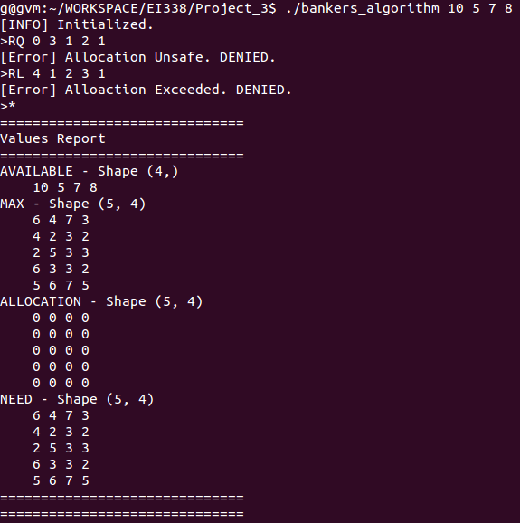
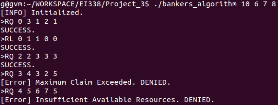

# Project 3 Report
EI338 Computer Systems Engineering, SJTU, 2020 Fall  
**by Prof. Li J.**
<!-- <br> -->


<br>

**TABLE OF CONTENTS**
<!-- MarkdownTOC -->

- [Description](#description)
- [Environment](#environment)
- [Project Details](#project-details)
    - [Banker's Algorithm Data Structure](#bankers-algorithm-data-structure)
    - [Safety Algorithm](#safety-algorithm)
    - [Resources Request](#resources-request)
    - [Resources Release](#resources-release)
- [Experiment](#experiment)
    - [Test Commands](#test-commands)
    - [Test Results](#test-results)
- [Summary](#summary)
- [Appendix - All Codes](#appendix---all-codes)

<!-- /MarkdownTOC -->


<br>


<!-- <div style="page-break-after: always;"></div> -->


<a id="description"></a>
## Description
1. The project is based on the Programming Project **Banker's Algorithm** of Chapter 8 of *Operating System Concepts (10th Edition) by Abraham Silberschatz, Peter Baer Galvin, Greg Gagne*, with [source codes](https://github.com/greggagne/osc10e) provided.
2. The major tasks of the project are
    + Implement (& Output) Banker's Algorithm Data Structure
    + Using Safety Algorithm to Determine whether a State is Safe
    + Handle Processes' Resources Request
    + Handle Processes' Resources Release
3. The implementations are partly based on those by [@keithnull](https://github.com/keithnull/Learning-EI338/tree/master/Project-2-1)

<br>

<a id="environment"></a>
## Environment
+ Option 1: Linux
    * OS: `Ubuntu 14.04 LTS`, Linux Kernel Version `4.4.0-142-generic`
    * Compiler: `GCC Version 4.8.4`
+ Option 2: Windows
    * OS: `Windows 8.1 Pro 64bit`
    * Compiler: `GCC Version 8.1.0`

<br>


<a id="project-details"></a>
## Project Details
As a matter of fact, the functionalities are not related to kernels, but more of some basic control logics. Thus, they are somehow really straightforward and can be actually implemented in various languages and tested on different platforms.

<a id="bankers-algorithm-data-structure"></a>
### Banker's Algorithm Data Structure
The basic data structures `available, maximum, allocation, need` are already given in the handouts. We ought to implement a function to conduct format outputs of their values. For simplicity, we do not list the detailed naive `printf()`s here.

<br>

<a id="safety-algorithm"></a>
### Safety Algorithm
From Page 30 of Slide `lec8-OS`, the Safety Algorithm is given by,
<div style="text-align: center;">
    
</div>

which leads to the following codes:
```C++
const int NUM_CUSTOMERS = 5;
const int NUM_RESOURCES = 4;

int available[NUM_RESOURCES];                   // available amount of each resource
int allocation[NUM_CUSTOMERS][NUM_RESOURCES];   // amount currently allocated to each customer
int need[NUM_CUSTOMERS][NUM_RESOURCES];         // remaining need of each customer

/*!
 * Judge whether list A <= B Element-wise
 * @param opr_1             list A
 * @param opr_2             list B
 * @param len               length of the list (len(A)=len(B))
 * @return                  1 if (A<=B).all(); 0 otherwise
 */
int is_leq(const int *opr_1, const int *opr_2, int len) {
    for (int i = 0; i <= len - 1; i++) {
        if (opr_1[i] > opr_2[i]) {
            return 0;
        }
    }
    return 1;
}

/*!
 * Judge by Safety Algorithm whether a State is Safe
 * @return                  1 if safe; 0 if unsafe
 */
int state_is_safe() {
    int work[NUM_RESOURCES], finish[NUM_CUSTOMERS];
    memcpy(work, available, NUM_RESOURCES * sizeof(int));
    memset(finish, 0, NUM_CUSTOMERS * sizeof(int));

    int flag_found = 0;
    while (1) {
        flag_found = 0;
        for (int i = 0; i <= NUM_CUSTOMERS - 1; i++) {
            if (0 == finish[i] && 1 == is_leq(need[i], work, NUM_RESOURCES)) {
                flag_found = 1;
                for (int j = 0; j <= NUM_RESOURCES - 1; j++) {
                    work[j] += allocation[i][j];
                }
                finish[i] = 1;
                break;
            }
        }
        if (0 == flag_found) { break; }
    }
    if (0 == flag_found) {
        int is_all_true = 1;
        for (int i = 0; i <= NUM_CUSTOMERS - 1; i++) {
            if (1 != finish[i]) {
                is_all_true = 0;
                break;
            }
        }
        if (1 == is_all_true) { return 1; }
    }

    return 0;
}
```


<br>


<a id="resources-request"></a>
### Resources Request
From Page 31 of Slide `lec8-OS`, the Resource-Request Algorithm is given by,
<div style="text-align: center;">
    
</div>
    

which leads to the following codes:
```C++
const int NUM_CUSTOMERS = 5;
const int NUM_RESOURCES = 4;

int available[NUM_RESOURCES];                   // available amount of each resource
int allocation[NUM_CUSTOMERS][NUM_RESOURCES];   // amount currently allocated to each customer
int need[NUM_CUSTOMERS][NUM_RESOURCES];         // remaining need of each customer

/*!
 * React when Processes Request Resources
 * @param customer_idx      request customer index
 * @param request           requested resources amount
 * @return                  0 if success; negative otherwise
 */
int request_resources(int customer_idx, const int *request) {
    if (customer_idx < 0 || customer_idx > NUM_CUSTOMERS - 1) {
        printf("[Error] Invalid Customer Index. ");
        return -1;
    }
    if (0 == is_leq(request, need[customer_idx], NUM_RESOURCES)) {
        printf("[Error] Maximum Claim Exceeded. ");
        return -2;
    }
    if (0 == is_leq(request, available, NUM_RESOURCES)) {
        printf("[Error] Insufficient Available Resources. ");
        return -3;
    }

#ifdef DEBUG
    output_values();
#endif
    // try to allocate
    for (int r = 0; r <= NUM_RESOURCES - 1; r++) {
        available[r] -= request[r];
        allocation[customer_idx][r] += request[r];
        need[customer_idx][r] -= request[r];
    }
    int success = (1 == state_is_safe());
    if (1 == success) { return 0; }
    // if unsafe, restore the unsafe allocation
#ifdef DEBUG
    output_values();
#endif
    for (int r = 0; r <= NUM_RESOURCES - 1; r++) {
        available[r] += request[r];
        allocation[customer_idx][r] -= request[r];
        need[customer_idx][r] += request[r];
    }
    printf("[Error] Allocation Unsafe. ");
    return -4;
}
```

<br>


<a id="resources-release"></a>
### Resources Release
Intuitively, we release resources if and only if a process has completed all the operations related to them. In other words, it no longer needs them. As a result, while releasing resources, we only update the values of `available` and `allocation`.  
The codes are given as follows:
```C++
const int NUM_CUSTOMERS = 5;
const int NUM_RESOURCES = 4;

int available[NUM_RESOURCES];                   // available amount of each resource
int allocation[NUM_CUSTOMERS][NUM_RESOURCES];   // amount currently allocated to each customer

/*!
 * React when Processes Release Resources
 * @param customer_idx      release request customer index
 * @param release           requested released resources amount
 * @return                  0 if success; negative otherwise
 */
int release_resources(int customer_idx, const int *release) {
    if (customer_idx < 0 || customer_idx > NUM_CUSTOMERS - 1) {
        printf("[Error] Invalid Customer Index. ");
        return -1;
    }
    if (0 == is_leq(release, allocation[customer_idx], NUM_RESOURCES)) {
        printf("[Error] Alloaction Exceeded. ");
        return -2;
    }

#ifdef DEBUG
    output_values();
#endif
    // release
    for (int r = 0; r <= NUM_RESOURCES - 1; r++) {
        available[r] += release[r];
        allocation[customer_idx][r] -= release[r];
    }
#ifdef DEBUG
    output_values();
#endif

    return 0;
}
```


<br><br>


<div style="page-break-after: always;"></div>


<a id="experiment"></a>
## Experiment


<a id="test-commands"></a>
### Test Commands
The initialization file is given as (the same as that in the handouts):
```
6 4 7 3
4 2 3 2
2 5 3 3
6 3 3 2
5 6 7 5
```

The test commands are:
```bash
# Set 1: Commands on the Handouts
./bankers_algorithm 10 5 7 8
RQ 0 3 1 2 1
RL 4 1 2 3 1
*

# Set 2: More Commands
./bankers_algorithm 10 6 7 8
RQ 0 3 1 2 1
RL 0 1 1 0 0
RQ 2 2 3 3 3
RQ 3 4 3 2 5
RQ 4 5 6 7 5
```


<div style="page-break-after: always;"></div>


<a id="test-results"></a>
### Test Results
The test results are shown below:  
<div style="text-align: center;">
    
    
</div>


<br><br>

<a id="summary"></a>
## Summary
Generally speaking, the project implementation is more of a C++ language programming challenge. However, at the same time, it provides an insight of the resources management of operating systems.


<br><br><br>


<div style="page-break-after: always;"></div>


<a id="appendix---all-codes"></a>
## Appendix - All Codes
```C++
#include <bits/stdc++.h>

using namespace std;


// #define DEBUG


const int NUM_CUSTOMERS = 5;
const int NUM_RESOURCES = 4;
char INIT_FILENAME[100] = "./init.txt";         // initialization input filename, as MAX matrix

int available[NUM_RESOURCES];                   // available amount of each resource
int maximum[NUM_CUSTOMERS][NUM_RESOURCES];      // maximum demand of each customer
int allocation[NUM_CUSTOMERS][NUM_RESOURCES];   // amount currently allocated to each customer
int need[NUM_CUSTOMERS][NUM_RESOURCES];         // remaining need of each customer


int init(int argc, char *argv[], const char *resources_file);
void output_values();
int is_leq(const int *opr_1, const int *opr_2, int len);
int state_is_safe();
int request_resources(int customer_idx, const int *request);
int release_resources(int customer_idx, const int *release);


int main(int argc, char *argv[]) {

#ifdef DEBUG
    strcpy(INIT_FILENAME, "../Project_3/init.txt");
    argc = 5;
    char arg1[18] = "bankers_algorithm";
    char arg2[3] = "10", arg3[2] = "6", arg4[2] = "7", arg5[2] = "8";
    argv[0] = arg1;
    argv[1] = arg2;
    argv[2] = arg3;
    argv[3] = arg4;
    argv[4] = arg5;
#endif

    if (0 != init(argc, argv, INIT_FILENAME))
        return 0;
    printf(">");

    char op[5] = "";                            // commands: RQ, RL, * (STAT in proj 4)
    int op_success = -1;                        // operation succeeds: 0=×,1=√,-1=?
    while (1 == scanf("%s", op)) {
        op_success = -1;
        int customer_idx = -1;
        int request[NUM_RESOURCES];

        if (strcmp(op, "RQ") == 0) {            // request resources
            scanf("%d", &customer_idx);
            for (int i = 0; i <= NUM_RESOURCES - 1; ++i) {
                scanf("%d", &request[i]);
            }
            op_success = (0 == request_resources(customer_idx, request));
        }

        else if (strcmp(op, "RL") == 0) {       // release resources
            scanf("%d", &customer_idx);
            for (int i = 0; i <= NUM_RESOURCES - 1; ++i) {
                scanf("%d", &request[i]);
            }
            op_success = (0 == release_resources(customer_idx, request));
        }

        else if (strcmp(op, "*") == 0) {        // output values
            output_values();
            op_success = -1;
        }

        else {                                  // invalid operation identifier
            printf("[Error] Invalid Operation Identifier.\n");
            op_success = -1;
        }

        if (1 == op_success) printf("SUCCESS.\n");
        else if (0 == op_success) printf("DENIED.\n");
        printf(">");
    }

    return 0;
}


/*!
 * Init: Parse & Store Input AVAILABLE Values, Read MAX from File
 * @param argc              number of arguments
 * @param argv              arguments
 * @param resources_file    file in which MAX is stored
 * @return                  0 if success; negative otherwise
 */
int init(int argc, char *argv[], const char *resources_file) {
    if (1 + NUM_RESOURCES != argc) {
        printf("[Error] Incorrect Number of Initialization Parameters.\n");
        return -1;
    }

    // store the input values of AVAILABLE
    for (int i = 0; i <= NUM_RESOURCES - 1; i++) {
        available[i] = atoi(argv[i + 1]);
    }

    // get MAX values from the init file
    FILE *f = fopen(resources_file, "r");
    if (NULL == f) {                            // nullptr possibly not supported by the compiler
        printf("[Error] Failed to Open File: %s\n", resources_file);
        return -2;
    }
    for (int c = 0; c < NUM_CUSTOMERS; c++) {
        for (int r = 0; r <= NUM_RESOURCES - 1; r++) {
            fscanf(f, "%d", &maximum[c][r]);
            need[c][r] = maximum[c][r];
        }
    }
    fclose(f);

    printf("[INFO] Initialized.\n");
    return 0;
}

/*!
 * React when Processes Request Resources
 * @param customer_idx      request customer index
 * @param request           requested resources amount
 * @return                  0 if success; negative otherwise
 */
int request_resources(int customer_idx, const int *request) {
    if (customer_idx < 0 || customer_idx > NUM_CUSTOMERS - 1) {
        printf("[Error] Invalid Customer Index. ");
        return -1;
    }
    if (0 == is_leq(request, need[customer_idx], NUM_RESOURCES)) {
        printf("[Error] Maximum Claim Exceeded. ");
        return -2;
    }
    if (0 == is_leq(request, available, NUM_RESOURCES)) {
        printf("[Error] Insufficient Available Resources. ");
        return -3;
    }

#ifdef DEBUG
    output_values();
#endif
    // try to allocate
    for (int r = 0; r <= NUM_RESOURCES - 1; r++) {
        available[r] -= request[r];
        allocation[customer_idx][r] += request[r];
        need[customer_idx][r] -= request[r];
    }
    int success = (1 == state_is_safe());
    if (1 == success) { return 0; }
    // if unsafe, restore the unsafe allocation
#ifdef DEBUG
    output_values();
#endif
    for (int r = 0; r <= NUM_RESOURCES - 1; r++) {
        available[r] += request[r];
        allocation[customer_idx][r] -= request[r];
        need[customer_idx][r] += request[r];
    }
    printf("[Error] Allocation Unsafe. ");
    return -4;
}

/*!
 * React when Processes Release Resources
 * @param customer_idx      release request customer index
 * @param release           requested released resources amount
 * @return                  0 if success; negative otherwise
 */
int release_resources(int customer_idx, const int *release) {
    if (customer_idx < 0 || customer_idx > NUM_CUSTOMERS - 1) {
        printf("[Error] Invalid Customer Index. ");
        return -1;
    }
    if (0 == is_leq(release, allocation[customer_idx], NUM_RESOURCES)) {
        printf("[Error] Alloaction Exceeded. ");
        return -2;
    }

#ifdef DEBUG
    output_values();
#endif
    // release
    for (int r = 0; r <= NUM_RESOURCES - 1; r++) {
        available[r] += release[r];
        allocation[customer_idx][r] -= release[r];
    }
#ifdef DEBUG
    output_values();
#endif

    return 0;
}


/*!
 * Judge whether list A <= B Element-wise
 * @param opr_1             list A
 * @param opr_2             list B
 * @param len               length of the list (len(A)=len(B))
 * @return                  1 if (A<=B).all(); 0 otherwise
 */
int is_leq(const int *opr_1, const int *opr_2, int len) {
    for (int i = 0; i <= len - 1; i++) {
        if (opr_1[i] > opr_2[i]) {
            return 0;
        }
    }
    return 1;
}

/*!
 * Judge by Safety Algorithm whether a State is Safe
 * @return                  1 if safe; 0 if unsafe
 */
int state_is_safe() {
    int work[NUM_RESOURCES], finish[NUM_CUSTOMERS];
    memcpy(work, available, NUM_RESOURCES * sizeof(int));
    memset(finish, 0, NUM_CUSTOMERS * sizeof(int));

    int flag_found = 0;
    while (1) {
        flag_found = 0;
        for (int i = 0; i <= NUM_CUSTOMERS - 1; i++) {
            if (0 == finish[i] && 1 == is_leq(need[i], work, NUM_RESOURCES)) {
                flag_found = 1;
                for (int j = 0; j <= NUM_RESOURCES - 1; j++) {
                    work[j] += allocation[i][j];
                }
                finish[i] = 1;
                break;
            }
        }
        if (0 == flag_found) { break; }
    }
    if (0 == flag_found) {
        int is_all_true = 1;
        for (int i = 0; i <= NUM_CUSTOMERS - 1; i++) {
            if (1 != finish[i]) {
                is_all_true = 0;
                break;
            }
        }
        if (1 == is_all_true) { return 1; }
    }

    return 0;
}


/*!
 * Output Values: AVAILABLE, MAX, ALLOCATION, NEED
 */
void output_values() {
    string indent = "    ";
    string end_of_field = "";
    printf("==============================\n");
    printf("Values Report\n");
    printf("==============================\n%s", end_of_field.c_str());

    // AVAILABLE: Available Resources
    printf("AVAILABLE - Shape (%d,)\n", NUM_RESOURCES);
    printf("%s", indent.c_str());
    for (int i = 0; i <= NUM_RESOURCES - 1; i++) {
        printf("%d ", available[i]);
    }
    printf("\n%s", end_of_field.c_str());

    // MAX: Maximum Resources for Each Customer
    printf("MAX - Shape (%d, %d)\n", NUM_CUSTOMERS, NUM_RESOURCES);
    for (int c = 0; c <= NUM_CUSTOMERS - 1; c++) {
        printf("%s", indent.c_str());
        for (int r = 0; r <= NUM_RESOURCES - 1; r++) {
            printf("%d ", maximum[c][r]);
        }
        printf("\n");
    }
    printf("%s", end_of_field.c_str());

    // ALLOCATION: Allocated Resources for Each Customer
    printf("ALLOCATION - Shape (%d, %d)\n", NUM_CUSTOMERS, NUM_RESOURCES);
    for (int c = 0; c <= NUM_CUSTOMERS - 1; c++) {
        printf("%s", indent.c_str());
        for (int r = 0; r <= NUM_RESOURCES - 1; r++) {
            printf("%d ", allocation[c][r]);
        }
        printf("\n");
    }
    printf("%s", end_of_field.c_str());

    // NEED: Remaining Resources Needs for Each Customer
    printf("NEED - Shape (%d, %d)\n", NUM_CUSTOMERS, NUM_RESOURCES);
    for (int c = 0; c <= NUM_CUSTOMERS - 1; c++) {
        printf("%s", indent.c_str());
        for (int r = 0; r <= NUM_RESOURCES - 1; r++) {
            printf("%d ", need[c][r]);
        }
        printf("\n");
    }
    printf("%s", end_of_field.c_str());

    printf("==============================\n");
    printf("==============================\n");
}
```