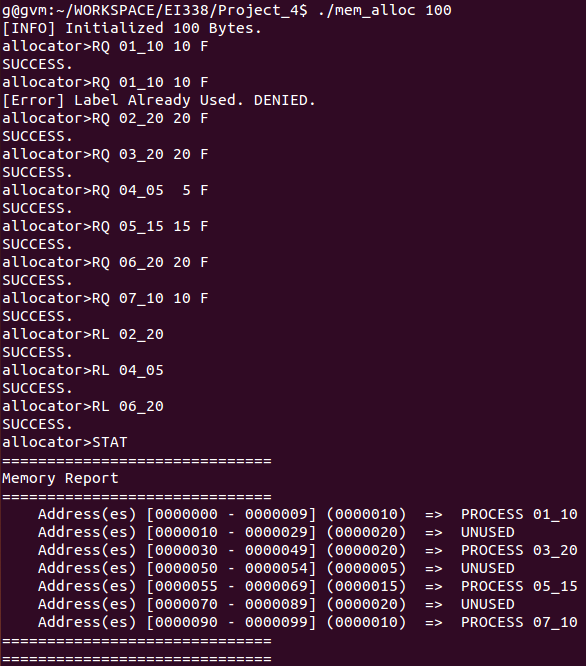
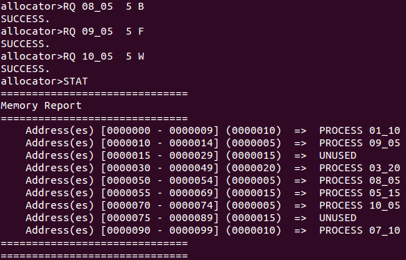
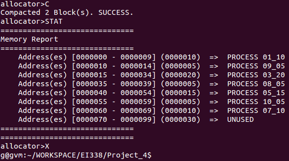

# Project 4 Report
EI338 Computer Systems Engineering, SJTU, 2020 Fall  
**by Prof. Li J.**
<!-- <br> -->


<br>

**TABLE OF CONTENTS**
<!-- MarkdownTOC -->

- [Description](#description)
- [Environment](#environment)
- [Project Details](#project-details)
    - [Memory Block Representation](#memory-block-representation)
    - [Request Memory](#request-memory)
    - [Release Memory](#release-memory)
    - [Unused Memory Holes Compaction](#unused-memory-holes-compaction)
    - [Additional Features](#additional-features)
- [Experiment](#experiment)
    - [Test Commands](#test-commands)
    - [Test Results](#test-results)
- [Summary](#summary)
- [Appendix - All Codes](#appendix---all-codes)

<!-- /MarkdownTOC -->


<br>


<!-- <div style="page-break-after: always;"></div> -->


<a id="description"></a>
## Description
1. The project is based on the Programming Project **Contiguous Memory Allocation** of Chapter 9 of *Operating System Concepts (10th Edition) by Abraham Silberschatz, Peter Baer Galvin, Greg Gagne*, with [source codes](https://github.com/greggagne/osc10e) provided.
2. The major tasks of the project are
    + Request for a Contiguous Block of Memory
    + Release a Contiguous Block of Memory
    + Compact Unused Holes of Memory into One Single Block
    + Report the Memory Allocation Status
3. The implementations are partly based on those by [@keithnull](https://github.com/keithnull/Learning-EI338/tree/master/Project-2-1)

<br>

<a id="environment"></a>
## Environment
+ Option 1: Linux
    * OS: `Ubuntu 14.04 LTS`, Linux Kernel Version `4.4.0-142-generic`
    * Compiler: `GCC Version 4.8.4`
+ Option 2: Windows
    * OS: `Windows 8.1 Pro 64bit`
    * Compiler: `GCC Version 8.1.0`

<br>


<a id="project-details"></a>
## Project Details
As a matter of fact, the functionalities are not related to kernels, but more of some basic control logics and linked list data structures. Thus, they are somehow really straightforward and can be actually implemented in various languages and tested on different platforms.  
Meanwhile, for simplicity, functionalities such as initialization, output memory usage, `main()` design are not described in the report. As for the codes, please refer the full codes in the appendix.


<a id="memory-block-representation"></a>
### Memory Block Representation
To allocate the available memory, intuitively, we may,

+ Create a list of length equal to the toatl memeory size, each element (say, the i-th) of which is the i-th byte of the memory.
+ When allocating memory, let the target bytes be used by the requested process.
+ When releasing memory, let the target bytes be unused again.

However, such approach requires to store the name of the allocation process fro each byte, which results in a high space complexity.  
Therefore, from the concepts of linked lists, we come to the following approach,

+ Instead of maintaining the information of each byte, we create `struct`s to represent memory blocks. These blocks representations are managed by connecting via linked list.
+ A memory block representation stores,
    * corresponding start byte index
    * corresponding end byte index
    * size of the memory
    * whether the block is used
    * possible label of the allocation process
    * pointer to the previous block in the linked list
    * pointer to the next block in the linked list

As a result, we get the following emmory block representation design,
```C++
struct MEMORY_BLOCK {                           // memory block representation
    size_t start = -1, end = -1, size = -1;
    int used = -1;
    char *label = NULL;
    struct MEMORY_BLOCK *prev = NULL, *next = NULL;
};
MEMORY_BLOCK *MEMORY_ALL;                       // head of memory blocks representations linked list
```

Furthermore, to allocate memory (especially when there is remaining memory in the target hole), we ought to "create a new block", which is implemented in the following codes,
```C++
/*!
 * Create a New Memory Block Representation Object
 * @param start             start index of the new memory block
 * @param end               end index of the new memory block
 * @param label             label of the new memory block
 * @param prev              pointer of the previous memory block
 * @param next              pointer of the next memory block
 * @return                  newly created memory block
 */
MEMORY_BLOCK *create_new_block(size_t start, size_t end, const char *label, int used,
                               MEMORY_BLOCK *prev, MEMORY_BLOCK *next) {
    MEMORY_BLOCK *new_block = new MEMORY_BLOCK;
    if (NULL == new_block) {
        printf("[Error] Failed to Create New Memory Block Representation.\n");
        free_space();
        exit(-1);
    }

    // assign values of the features of the new memory block
    new_block->start = start;
    new_block->end = end;
    new_block->size = end - start + 1;
    if (0 == strlen(label) && 0 == used) {      // unused block
        new_block->label = NULL;
        new_block->used = 0;
    }
    else if (0 != strlen(label) && 1 == used) { // used blocks
        new_block->label = new char[sizeof(char) * (strlen(label) + 1)];
        strcpy(new_block->label, label);
        new_block->used = 1;
    }
    else {                                      // invalid conditions
        delete new_block;
        printf("[Error] Used & StrLen Mismatch.\n");
        free_space();
        exit(-2);
    }
    // insert and link the new block
    new_block->prev = prev;
    new_block->next = next;
    if (NULL != prev) { prev->next = new_block; }
    if (NULL != next) { next->prev = new_block; }

    return new_block;
}
```


<br>


<a id="request-memory"></a>
### Request Memory
To request and allocate memory, there are two major concerns,

+ Three modes,
    * `F`: first fit, i.e., the first hole whose size is no less than the target size
    * `B`: best fit, i.e., the minimum (also the first of multiple) hole
    * `W`: worst fit, i.e., the maximum (also the first if multiple) hole
+ Allocate in the best hole under different modes,
    * If the size of the hole is exactly the same as that of the target, simply update the information of the hole memeory block representation.
    * Otherwise, split the hole into,
        - Used block: update information by the allocation request
        - Unused block: new block of the remaining memory, inserted into the linked list

which leads to the following codes,  
```C++
// #define DEBUG                                   // debug mode switch

struct MEMORY_BLOCK {                           // memory block representation
    size_t start = -1, end = -1, size = -1;
    int used = -1;
    char *label = NULL;
    struct MEMORY_BLOCK *prev = NULL, *next = NULL;
};
size_t MEMORY_SIZE = 0;                         // initialized total memory size
MEMORY_BLOCK *MEMORY_ALL;                       // head of memory blocks representations linked list

/*!
 * Find the Best Hole to Allocate, under various modes
 * @param size              size of the requested memory allocation
 * @param mode              allocation mode, supports:
 *                              F: first fit
 *                              B: best fit, allocate in the minimum (&first if multiple) hole
 *                              W: worst fit, allocate in the maximum (&first if multiple) hole
 * @return                  pointer to the the best hole if found; NULL otherwise
 */
MEMORY_BLOCK *find_best_hole(size_t size, char mode) {
    MEMORY_BLOCK *crt_block = MEMORY_ALL;
    MEMORY_BLOCK *best_block = NULL;            // pointer to the best block under various modes
    size_t min_size = MEMORY_SIZE;              // size of the best block under BEST mode
    size_t max_size = 0;                        // size of the best block under WORST mode
    while (NULL != crt_block) {
        if (0 != crt_block->used || crt_block->size < size) {
            crt_block = crt_block->next;
            continue;
        }

        switch (mode) {
            case 'F':                           // first fit
                return crt_block;
            case 'B': {                         // best fit
                if (crt_block->size < min_size) {
                    best_block = crt_block;
                    min_size = crt_block->size;
                }
                break;
            }
            case 'W': {                         // worst fit
                if (crt_block->size > max_size) {
                    best_block = crt_block;
                    max_size = crt_block->size;
                }
                break;
            }
            default: {
                printf("[Error] Unknown Mode %c.\n", mode);
                return NULL;
            }
        }
        crt_block = crt_block->next;
    }

    return best_block;
}

/*!
 * React when Processes Request to Allocate Memory, in a Certain Mode
 * @param label             label of the requesting process
 * @param size              size of the requested memory allocation
 * @param mode              allocation mode, supports:
 *                              F: first fit
 *                              B: best fit, allocate in the minimum (&first if multiple) hole
 *                              W: worst fit, allocate in the maximum (&first if multiple) hole
 * @return                  0 if success; negative otherwise
 */
int request_memory(const char *label, size_t size, char mode) {
    if (size > MEMORY_SIZE) {
        printf("[Error] Request Memory Exceeds Maximum Memory. ");
        return -1;
    }
    MEMORY_BLOCK *hole = find_best_hole(size, mode);
    if (NULL == hole) {
        printf("[Error] No Available Memory Holes. ");
        return -2;
    }
    /* SOME CODES */

    hole->label = new char[sizeof(char) * (strlen(label) + 1)];
    strcpy(hole->label, label);
    hole->used = 1;

    // split the remaining memory if exists
    if (size != hole->size) {
        hole->next = create_new_block(hole->start + size, hole->end,
                                      "", 0, hole, hole->next);
        hole->end = hole->start + size - 1;
        hole->size = size;
    }
    /* SOME CODES */
#ifdef DEBUG
    output_values();
#endif
    return 0;
}
```


<br>


<a id="release-memory"></a>
### Release Memory
To release the allocated memory, there are two major concerns,

+ Find and mark the target block as unused.
+ Merge the released block with adjacent unused blocks.
    * For simplicity, we only merge with previous unused blocks.
    * Carefully handle cases where the merged block becomes the head of the linked list.

which leads to the following codes,  
```C++
// #define DEBUG                                   // debug mode switch

struct MEMORY_BLOCK {                           // memory block representation
    size_t start = -1, end = -1, size = -1;
    int used = -1;
    char *label = NULL;
    struct MEMORY_BLOCK *prev = NULL, *next = NULL;
};
size_t MEMORY_SIZE = 0;                         // initialized total memory size
MEMORY_BLOCK *MEMORY_ALL;                       // head of memory blocks representations linked list

/*!
 * React when Processes Release Memory Allocation
 *      [ALERT] Memory of ONLY 1ST Processes with Duplicate Labels will be Released
 * @param label             label of the to-release process
 * @return                  0 if success; negative otherwise
 */
int release_memory(const char *label) {
    MEMORY_BLOCK *crt_block = MEMORY_ALL;
    int target_idx = 0;
    int target_found = 0;
    while (NULL != crt_block) {
        // target NOT found
        if (0 == target_found) {
            // the current is NOT the target (unused or !label)
            if (0 == crt_block->used || 0 != strcmp(crt_block->label, label)) {
                crt_block = crt_block->next;
                target_idx++;
                continue;
            }
                // the current IS the target
            else if (1 == crt_block->used && 0 == strcmp(crt_block->label, label)) {
                target_found = 1;
                delete[] crt_block->label;
                crt_block->label = NULL;
                crt_block->used = 0;
                /* SOME CODES */
            }
                // internal error
            else {
                printf("[Error] Internal Error. "
                       "Possibly Unused Blocks have Labels.\n");
                free_space();
                exit(-3);
            }

        }
        // target IS found (and thus is already updated)
        //      possibly merge the current unused block with the previous unused block
        if (NULL != crt_block->prev && 0 == crt_block->prev->used && 0 == crt_block->used) {
            MEMORY_BLOCK *crt_block_prev = crt_block->prev;
            crt_block->prev = crt_block_prev->prev;
            if (NULL != crt_block_prev->prev) {
                crt_block_prev->prev->next = crt_block;
            }
            crt_block->start = crt_block_prev->start;
            crt_block->size += crt_block_prev->size;
            delete crt_block_prev;
        }
        // handle the case that the head is deleted
        //      happens when the head is released & head->next is unused
        if (NULL == crt_block->prev) {
            MEMORY_ALL = crt_block;
        }

        crt_block = crt_block->next;
        target_idx++;
    }

    if (0 == target_found) {                    // the target process label is not found
        printf("[Error] Invalid Process Label. ");
        return -1;
    }
#ifdef DEBUG
    output_values();
#endif
    return 0;
}
```

<br>


<a id="unused-memory-holes-compaction"></a>
### Unused Memory Holes Compaction
To compact scattered unused memory holes, intuitively, we come to the following approach,

+ Adjacent Unused Blocks: similar to the merging operations in the memory release, combine adjacent unused blocks through iteratively merge with the previous unused block.
+ Nonadjacent Unused Blocks: Swap the blocks, i.e., relink the blocks, edit the information (`used, start, end, size`).

Therefore, more detailed implementation descriptions are given as,

+ If the current block is unused and the previous block is unused
    * corresponds to the first operation described in the above approach
    * merge, in the same way as that is done in the memory release
+ If the current block is used and the previous block is unused
    * corresponds to the second operation described in the above approach
    * for simplicity, we do not do relinking
    * instead, we update fields `used, start, end, size` of both blocks, as if we "swapped"

which leads to the following codes,  
```C++
// #define DEBUG                                   // debug mode switch

struct MEMORY_BLOCK {                           // memory block representation
    size_t start = -1, end = -1, size = -1;
    int used = -1;
    char *label = NULL;
    struct MEMORY_BLOCK *prev = NULL, *next = NULL;
};
size_t MEMORY_SIZE = 0;                         // initialized total memory size
MEMORY_BLOCK *MEMORY_ALL;                       // head of memory blocks representations linked list

/*!
 * React to Compact Unused Blocks
 *      1. prev used, current unused => swap
 *      2. prev unused, current unused => merge
 * @return                  0 if success; negative otherwise
 */
int compact() {
    int compaction_cnt = 0;
    MEMORY_BLOCK *crt_block = MEMORY_ALL;
    while (NULL != crt_block) {
        if (NULL == crt_block->prev || 1 == crt_block->prev->used) {
            crt_block = crt_block->next;
            continue;
        }

        // case I: prev unused, current used => swap (by memory info)
        if (1 == crt_block->used) {
            // swap label pointers
            crt_block->prev->label = crt_block->label;
            crt_block->label = NULL;
            // update used
            crt_block->prev->used = 1;
            crt_block->used = 0;
            // update start, end, size
            size_t temp_prev_size = crt_block->prev->size;
            crt_block->prev->end = crt_block->prev->start + crt_block->size - 1;
            crt_block->prev->size = crt_block->size;
            crt_block->start = crt_block->prev->end + 1;
            crt_block->size = temp_prev_size;
        }

            // case II: prev unused, current unused => merge
        else {
            cout << "prev unused" << endl;
            MEMORY_BLOCK *crt_block_prev = crt_block->prev;
            crt_block->prev = crt_block_prev->prev;
            if (NULL != crt_block_prev->prev) {
                crt_block_prev->prev->next = crt_block;
            }
            crt_block->start = crt_block_prev->start;
            crt_block->size += crt_block_prev->size;
            delete crt_block_prev;
            compaction_cnt++;
        }

        // handle the case that the head is deleted
        //      happens when the head is released & head->next is unused
        if (NULL == crt_block->prev) {
            MEMORY_ALL = crt_block;
        }

        crt_block = crt_block->next;
    }

    printf("Compacted %d Block(s). ", compaction_cnt + 1);
#ifdef DEBUG
    output_values();
#endif
    return 0;
}
```


<br>

<a id="additional-features"></a>
### Additional Features
Furthermore, we may notice that, while releasing allocated memory, if there are multiple memory blocks instances with labels all the same as the target, only the first will be released.  
However, in practice, we ought not requestto allocate memory for different "processes" but with the same label.  
Therefore, we may maintain a vector to store the used labels.

+ While requesting memory, check for duplicates and append the label if memory is successfully allocated.
+ While releasing memory, delete the corresponding label of the released block.

which leads to the following additional codes fragements,
```C++
#ifdef CHECK_LABEL
vector<string> USED_LABELS = {};                // vector of used labels
#endif
#ifdef CHECK_LABEL
vector<string> USED_LABELS = {};                // vector of used labels
#endif

int request_memory(const char *label, size_t size, char mode) {
    /* SOME CODES */
#ifdef CHECK_LABEL
    string label_str = label;
    int label_is_used = (find(USED_LABELS.begin(), USED_LABELS.end(), label_str)
                         != USED_LABELS.end());
    if (1 == label_is_used) {
        printf("[Error] Label Already Used. ");
        return -3;
    }
#endif
    /* SOME CODES */
#ifdef CHECK_LABEL
    USED_LABELS.push_back(label_str);
#endif
    /* SOME CODES */
}

int release_memory(const char *label) {
    /* SOME CODES */
    while (NULL != crt_block) {
        // target NOT found
        if (0 == target_found) { /* SOME CODES */ }
            // the current IS the target
            else if (1 == crt_block->used && 0 == strcmp(crt_block->label, label)) {
                /* SOME CODES */
#ifdef CHECK_LABEL
                USED_LABELS.erase(USED_LABELS.begin() + target_idx);
#endif
            }
            /* SOME CODES */
        }
        /* SOME CODES */
    }
    /* SOME CODES */
}

```

<br><br>


<div style="page-break-after: always;"></div>


<a id="experiment"></a>
## Experiment


<a id="test-commands"></a>
### Test Commands
The test commands are, (notations such as `10, [20]` indicates that a UNUSED memory block of size 20 followsa USED memory block of size 10)
```bash
./mem_alloc 100
# [PART I] to achieve memory usage like: 10 [20] 20 [5] 15 [20] 10
RQ 01_10 10 F
RQ 01_10 10 F
RQ 02_20 20 F
RQ 03_20 20 F
RQ 04_05  5 F
RQ 05_15 15 F
RQ 06_20 20 F
RQ 07_10 10 F
RL 02_20
RL 04_05
RL 06_20
STAT

# [PART II] to test allocation modes in usage like: 10 [20] 20 [5] 15 [20] 10
RQ 08_05  5 B
RQ 09_05  5 F
RQ 10_05  5 W
STAT

# [PART III] to test compaction in usage like: 10 5 [15] 20 5 15 5 [15] 10
C
STAT
# to test exit
X
```


<div style="page-break-after: always;"></div>


<a id="test-results"></a>
### Test Results
The test results are shown below,     
<div style="text-align: center;">
    
    
    
</div>


<br><br>

<a id="summary"></a>
## Summary
Generally speaking, the project tasks are more of a C++ language and linked list data structure programming, about which I have forgotten most details. At the same time, it provides an insight of the resources management of operating systems.  
To sum up, time-consuming and difficult though for me, the lab contents are solid and helpful.


<br><br><br>


<div style="page-break-after: always;"></div>


<a id="appendix---all-codes"></a>
## Appendix - All Codes

```C++
#include <bits/stdc++.h>

using namespace std;


// #define DEBUG                                   // debug mode switch
#define CHECK_LABEL                             // whether to ensure no duplicate labels


struct MEMORY_BLOCK {                           // memory block representation
    size_t start = -1, end = -1, size = -1;
    int used = -1;
    char *label = NULL;
    struct MEMORY_BLOCK *prev = NULL, *next = NULL;
};
size_t MEMORY_SIZE = 0;                         // initialized total memory size
MEMORY_BLOCK *MEMORY_ALL;                       // head of memory blocks representations linked list
const int MAX_LABEL_LEN = 10;                   // maximum length of the labels of processed
#ifdef CHECK_LABEL
vector<string> USED_LABELS = {};                // vector of used labels
#endif


MEMORY_BLOCK *create_new_block(size_t start, size_t end, const char *label, int used,
                               MEMORY_BLOCK *prev, MEMORY_BLOCK *next);
int init(int argc, char *argv[]);
void output_values();
MEMORY_BLOCK *find_best_hole(size_t size, char mode);
int request_memory(const char *label, size_t size, char mode);
int release_memory(const char *label);
int compact();
void free_space();


int main(int argc, char *argv[]) {

#ifdef DEBUG
    argc = 2;
    char arg1[18] = "./mem_alloc";
    // char arg2[8] = "1048576";
    char arg2[4] = "100";
    argv[0] = arg1;
    argv[1] = arg2;
    freopen("../Project_4/test_inputs.txt", "r", stdin);
#endif

    if (0 != init(argc, argv)) return 0;
    printf("allocator>");

    char op[5] = "";                            // commands: RQ, RL, C, STAT, X
    int op_success = -1;                        // operation succeeds: 0=×,1=√,-1=?
    while (1 == scanf("%s", op)) {
        op_success = -1;
        char label[MAX_LABEL_LEN];              // operand label
        size_t size = -1;                       // operand target memory size
        char mode;                              // operand resources allocation request mode

        if (strcmp(op, "RQ") == 0) {            // request memory
            scanf("%s %zu %c", label, &size, &mode);
            op_success = (0 == request_memory(label, size, mode));
        }

        else if (strcmp(op, "RL") == 0) {       // release memory
            scanf("%s", label);
            op_success = (0 == release_memory(label));
        }

        else if (strcmp(op, "STAT") == 0) {     // output memory usage status
            output_values();
            op_success = -1;
        }

        else if (strcmp(op, "C") == 0) {        // compact unused memory blocks
            op_success = (0 == compact());
        }

        else if (strcmp(op, "X") == 0) {        // exit
            free_space();
            break;
        }
        else {                                  // invalid operation identifier
            printf("[Error] Invalid Operation Identifier.\n");
            op_success = -1;
        }

        if (1 == op_success) printf("SUCCESS.\n");
        else if (0 == op_success) printf("DENIED.\n");
        printf("allocator>");
    }

    return 0;
}

/*!
 * Init: Parse & Store Input AVAILABLE Values, Read MAX from File
 * @param argc              number of arguments
 * @param argv              arguments
 * @param resources_file    file in which MAX is stored
 * @return                  0 if success; negative otherwise
 */
int init(int argc, char *argv[]) {
    if (2 != argc) {
        printf("[Error] Incorrect Number of Initialization Parameters.\n");
        return -1;
    }

    sscanf(argv[1], "%zu", &MEMORY_SIZE);
    MEMORY_ALL = create_new_block(0, MEMORY_SIZE - 1,
                                  "", 0, NULL, NULL);

    printf("[INFO] Initialized %zu Bytes.\n", MEMORY_SIZE);
    return 0;
}


/*!
 * React when Processes Request to Allocate Memory, in a Certain Mode
 * @param label             label of the requesting process
 * @param size              size of the requested memory allocation
 * @param mode              allocation mode, supports:
 *                              F: first fit
 *                              B: best fit, allocate in the minimum (&first if multiple) hole
 *                              W: worst fit, allocate in the maximum (&first if multiple) hole
 * @return                  0 if success; negative otherwise
 */
int request_memory(const char *label, size_t size, char mode) {
    if (size > MEMORY_SIZE) {
        printf("[Error] Request Memory Exceeds Maximum Memory. ");
        return -1;
    }
    MEMORY_BLOCK *hole = find_best_hole(size, mode);
    if (NULL == hole) {
        printf("[Error] No Available Memory Holes. ");
        return -2;
    }
#ifdef CHECK_LABEL
    string label_str = label;
    int label_is_used = (find(USED_LABELS.begin(), USED_LABELS.end(), label_str)
                         != USED_LABELS.end());
    if (1 == label_is_used) {
        printf("[Error] Label Already Used. ");
        return -3;
    }
#endif

    hole->label = new char[sizeof(char) * (strlen(label) + 1)];
    strcpy(hole->label, label);
    hole->used = 1;

    // split the remaining memory if exists
    if (size != hole->size) {
        hole->next = create_new_block(hole->start + size, hole->end,
                                      "", 0, hole, hole->next);
        hole->end = hole->start + size - 1;
        hole->size = size;
    }
#ifdef CHECK_LABEL
    USED_LABELS.push_back(label_str);
#endif
#ifdef DEBUG
    output_values();
#endif
    return 0;
}

/*!
 * React when Processes Release Memory Allocation
 *      [ALERT] Memory of ONLY 1ST Processes with Duplicate Labels will be Released
 * @param label             label of the to-release process
 * @return                  0 if success; negative otherwise
 */
int release_memory(const char *label) {
    MEMORY_BLOCK *crt_block = MEMORY_ALL;
    int target_idx = 0;
    int target_found = 0;
    while (NULL != crt_block) {
        // target NOT found
        if (0 == target_found) {
            // the current is NOT the target (unused or !label)
            if (0 == crt_block->used || 0 != strcmp(crt_block->label, label)) {
                crt_block = crt_block->next;
                target_idx++;
                continue;
            }
                // the current IS the target
            else if (1 == crt_block->used && 0 == strcmp(crt_block->label, label)) {
                target_found = 1;
                delete[] crt_block->label;
                crt_block->label = NULL;
                crt_block->used = 0;
#ifdef CHECK_LABEL
                USED_LABELS.erase(USED_LABELS.begin() + target_idx);
#endif
            }
                // internal error
            else {
                printf("[Error] Internal Error. "
                       "Possibly Unused Blocks have Labels.\n");
                free_space();
                exit(-3);
            }

        }
        // target IS found (and thus is already updated)
        //      possibly merge the current unused block with the previous unused block
        if (NULL != crt_block->prev && 0 == crt_block->prev->used && 0 == crt_block->used) {
            MEMORY_BLOCK *crt_block_prev = crt_block->prev;
            crt_block->prev = crt_block_prev->prev;
            if (NULL != crt_block_prev->prev) {
                crt_block_prev->prev->next = crt_block;
            }
            crt_block->start = crt_block_prev->start;
            crt_block->size += crt_block_prev->size;
            delete crt_block_prev;
        }
        // handle the case that the head is deleted
        //      happens when the head is released & head->next is unused
        if (NULL == crt_block->prev) {
            MEMORY_ALL = crt_block;
        }

        crt_block = crt_block->next;
        target_idx++;
    }

    if (0 == target_found) {                    // the target process label is not found
        printf("[Error] Invalid Process Label. ");
        return -1;
    }
#ifdef DEBUG
    output_values();
#endif
    return 0;
}

/*!
 * React to Compact Unused Blocks
 *      1. prev used, current unused => swap
 *      2. prev unused, current unused => merge
 * @return                  0 if success; negative otherwise
 */
int compact() {
    int compaction_cnt = 0;
    MEMORY_BLOCK *crt_block = MEMORY_ALL;
    while (NULL != crt_block) {
        if (NULL == crt_block->prev || 1 == crt_block->prev->used) {
            crt_block = crt_block->next;
            continue;
        }

        // case I: prev unused, current used => swap (by memory info)
        if (1 == crt_block->used) {
            // swap label pointers
            crt_block->prev->label = crt_block->label;
            crt_block->label = NULL;
            // update used
            crt_block->prev->used = 1;
            crt_block->used = 0;
            // update start, end, size
            size_t temp_prev_size = crt_block->prev->size;
            crt_block->prev->end = crt_block->prev->start + crt_block->size - 1;
            crt_block->prev->size = crt_block->size;
            crt_block->start = crt_block->prev->end + 1;
            crt_block->size = temp_prev_size;
        }

            // case II: prev unused, current unused => merge
        else {
            MEMORY_BLOCK *crt_block_prev = crt_block->prev;
            crt_block->prev = crt_block_prev->prev;
            if (NULL != crt_block_prev->prev) {
                crt_block_prev->prev->next = crt_block;
            }
            crt_block->start = crt_block_prev->start;
            crt_block->size += crt_block_prev->size;
            delete crt_block_prev;
            compaction_cnt++;
        }

        // handle the case that the head is deleted
        //      happens when the head is released & head->next is unused
        if (NULL == crt_block->prev) {
            MEMORY_ALL = crt_block;
        }

        crt_block = crt_block->next;
    }

    printf("Compacted %d Block(s). ", compaction_cnt + 1);
#ifdef DEBUG
    output_values();
#endif
    return 0;
}


/*!
 * Create a New Memory Block Representation Object
 * @param start             start index of the new memory block
 * @param end               end index of the new memory block
 * @param label             label of the new memory block
 * @param prev              pointer of the previous memory block
 * @param next              pointer of the next memory block
 * @return                  newly created memory block
 */
MEMORY_BLOCK *create_new_block(size_t start, size_t end, const char *label, int used,
                               MEMORY_BLOCK *prev, MEMORY_BLOCK *next) {
    MEMORY_BLOCK *new_block = new MEMORY_BLOCK;
    if (NULL == new_block) {
        printf("[Error] Failed to Create New Memory Block Representation.\n");
        free_space();
        exit(-1);
    }

    // assign values of the features of the new memory block
    new_block->start = start;
    new_block->end = end;
    new_block->size = end - start + 1;
    if (0 == strlen(label) && 0 == used) {      // unused block
        new_block->label = NULL;
        new_block->used = 0;
    }
    else if (0 != strlen(label) && 1 == used) { // used blocks
        new_block->label = new char[sizeof(char) * (strlen(label) + 1)];
        strcpy(new_block->label, label);
        new_block->used = 1;
    }
    else {                                      // invalid conditions
        delete new_block;
        printf("[Error] Used & StrLen Mismatch.\n");
        free_space();
        exit(-2);
    }
    // insert and link the new block
    new_block->prev = prev;
    new_block->next = next;
    if (NULL != prev) { prev->next = new_block; }
    if (NULL != next) { next->prev = new_block; }

    return new_block;
}

/*!
 * Find the Best Hole to Allocate, under various modes
 * @param size              size of the requested memory allocation
 * @param mode              allocation mode, supports:
 *                              F: first fit
 *                              B: best fit, allocate in the minimum (&first if multiple) hole
 *                              W: worst fit, allocate in the maximum (&first if multiple) hole
 * @return                  pointer to the the best hole if found; NULL otherwise
 */
MEMORY_BLOCK *find_best_hole(size_t size, char mode) {
    MEMORY_BLOCK *crt_block = MEMORY_ALL;
    MEMORY_BLOCK *best_block = NULL;            // pointer to the best block under various modes
    size_t min_size = MEMORY_SIZE;              // size of the best block under BEST mode
    size_t max_size = 0;                        // size of the best block under WORST mode
    while (NULL != crt_block) {
        if (0 != crt_block->used || crt_block->size < size) {
            crt_block = crt_block->next;
            continue;
        }

        switch (mode) {
            case 'F':                           // first fit
                return crt_block;
            case 'B': {                         // best fit
                if (crt_block->size < min_size) {
                    best_block = crt_block;
                    min_size = crt_block->size;
                }
                break;
            }
            case 'W': {                         // worst fit
                if (crt_block->size > max_size) {
                    best_block = crt_block;
                    max_size = crt_block->size;
                }
                break;
            }
            default: {
                printf("[Error] Unknown Mode %c.\n", mode);
                return NULL;
            }
        }
        crt_block = crt_block->next;
    }

    return best_block;
}


/*!
 * Output Values: Memory Holes Usage Status
 */
void output_values() {
    string indent = "    ";
    printf("==============================\n");
    printf("Memory Report\n");
    printf("==============================\n");

    MEMORY_BLOCK *crt_block = MEMORY_ALL;
    while (NULL != crt_block) {
        printf("%sAddress(es) [%07zu - %07zu] (%07zu)",
               indent.c_str(), crt_block->start, crt_block->end, crt_block->size);
        if (0 == crt_block->used) {             // unused blocks
            printf("  =>  UNUSED\n");
        }
        else {                                  // used blocks
            printf("  =>  PROCESS %s\n", crt_block->label);
        }
        crt_block = crt_block->next;
    }

    printf("==============================\n");
    printf("==============================\n");
}

void free_space() {
    MEMORY_BLOCK *crt_block = MEMORY_ALL;
    while (NULL != crt_block) {
        if (NULL != crt_block->label) {
            delete[] crt_block->label;
        }
        crt_block = crt_block->next;
    }
}
```